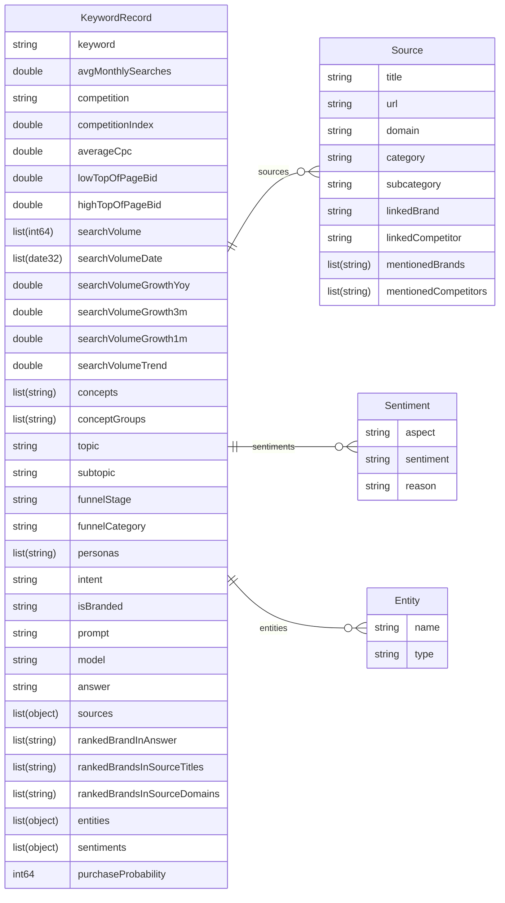

# LLM Audit

This document serves as context to understand how our AI Visibility audit works and the data it generates.

The purpose of the audit is to serve use cases such as:

- Identifying content gaps in AI-generated answers
- Understanding which competitors are mentioned in LLM responses and the sources the LLM has used to include them
- Tracking brand visibility across different LLM platforms
- Optimizing for AI-powered search and answer engines
- Analyzing purchase intent across the customer journey
- Discovering which topics and entities dominate LLM responses


## Table of Contents
- [Workflow](#workflow)
	- [1. Context Generation](#1-context-generation-generatecontext)
	- [2. Keyword Generation](#2-keyword-generation-generatekeywords)
	- [3. Keyword Enrichment](#3-keyword-enrichment-enrichkeywords)
	- [4. Prompt Translation](#4-prompt-translation)
	- [5. LLM Audit](#5-llm-audit-auditprompts)
	- [6. Audit Enrichment](#6-audit-enrichment-enrichaudit)
- [Output Datasets](#output-datasets)
	- [Keyword-prompt table](#keyword-prompt-table)
	- [Generated context: Brands](#generated-context-brands)
	- [Generated context: Personas](#generated-context-personas)
- [Possible questions and insights](#possible-questions-and-insights)
	- [Brand Visibility & Competition](#brand-visibility--competition)
	- [Brand Portfolio & Product Analysis](#brand-portfolio--product-analysis)
	- [Market Position & Competitive Intelligence](#market-position--competitive-intelligence)
	- [Geographic & Sector Analysis](#geographic--sector-analysis)
	- [Persona-Centric Analysis](#persona-centric-analysis)
	- [Official Domain & Source Authority](#official-domain--source-authority)
	- [Source & Content Analysis](#source--content-analysis)
	- [Funnel & Intent Analysis](#funnel--intent-analysis)
	- [Topic & Thematic Analysis](#topic--thematic-analysis)
	- [Search Volume & Opportunity](#search-volume--opportunity)
	- [LLM Platform Comparison](#llm-platform-comparison)
	- [Content Strategy & Prioritization](#content-strategy--prioritization)
	- [Entity & Relationship Analysis](#entity--relationship-analysis)
	- [Temporal & Trend Analysis](#temporal--trend-analysis)
	- [Executive Summary Metrics Dashboard](#executive-summary-metrics-dashboard)


# Workflow

A complete LLM audit flow executes a number of sequential phases, each producing enriched data for the next.

The following diagram illustrates how workflow phases connect and transform data:


The following are the phases in more detail.

## 1. Context Generation (`generateContext`)

Establishes the audit foundation by creating brand intelligence, competitive landscape, and user profiles:
- **Brand Analysis**: Generates comprehensive brand profile using LLMs with web search
- **Competitor Research**: Identifies and profiles competitors based on sector and market using LLMs with web search
- **Persona Development**: Creates customer personas tailored to sector and market
- **Funnel Customization**: Generates and seeds marketing funnel categories specific to sector and country

## 2. Keyword Generation (`generateKeywords`)
Expands seed keywords into comprehensive search term dataset:
- Aggregates seeds from sector, personas (keywordSeeds), and funnel categories (examples)
- Uses Google Ads Keyword Planner to expand and enrich with search volume, CPC, and competition data
- Returns dataset with keyword records including monthly trends and bid estimates

## 3. Keyword Enrichment (`enrichKeywords`)
Classifies keywords into marketing and semantic dimensions using batch LLM processing:
- **Topic Extraction**: Assigns primary topic and subtopic categories (semantic)
- **Intent Classification**: Determines user intent (informational, commercial, transactional)
- **Branded Detection**: Identifies branded vs. non-branded queries
- **Funnel Assignment**: Maps keywords to funnel stages and categories
- **Persona Matching**: Assigns relevant customer personas

## 4. Prompt Translation
Converts keywords into natural language prompts suitable for LLM auditing:
- Creates conversational prompts that trigger authentic LLM responses

## 5. LLM Audit (`auditPrompts`)
Queries target LLMs and analyzes brand visibility:
- **Model Querying**: Sends prompts to specified models (e.g., GPT-4.1, Claude, Gemini) with optional web search
- **Source Enrichment**: Links sources to brands/competitors and extracts brand mentions
- **Brand Ranking**: Ranks brands by appearance order in answers, source titles, and domains
- Returns enriched responses with structured source metadata and brand visibility metrics

## 6. Audit Enrichment (`enrichAudit`)
Performs deep analysis of LLM responses using additional AI processing:
- **Source Categorization**: Classifies sources by content category and subcategory
- **Aspect-Based Sentiment (ABS)**: Extracts sentiment per brand aspect from answers
- **Entity Extraction**: Identifies named entities (products, organizations, people) in responses
- **Purchase Probability**: Scores likelihood of purchase intent in answers

# Output Datasets

## Keyword-prompt table

Each record combines:
- Original keyword data (search volume, CPC, competition)
- Semantic enrichments (topic, intent, funnel stage, persona)
- LLM audit results (prompt, answer, model, sources, brand rankings)
- AI-extracted insights (entities, sentiments, purchase probability)

This is a diagram of the columns generated. `sources`, `sentiments` and `entities` are arrays of objects with each object having multiple fields.



Here is a plain list of all columns with added description of the corresponding values.

| Column                 | Type     | Label | Description                                                                    |
| ---------------------- | -------- | ----- |------------------------------------------------------------------------------ |
| **keyword**            | `string` | Keyword Core |The original search keyword or phrase.                                         |
| **avgMonthlySearches** | `double` | Keyword Core |Average number of monthly Google searches for the keyword.                     |
| **competition**        | `string` | Keyword Core |Qualitative measure of advertiser competition (e.g., “LOW”, “MEDIUM”, “HIGH”). |
| **competitionIndex**   | `double` | Keyword Core |Numeric representation of competition intensity.                               |
| **averageCpc**         | `double` | Keyword Core |Average cost-per-click (CPC) in Google Ads.                                    |
| **lowTopOfPageBid**    | `double` | Keyword Core |Lower bound of top-of-page bid estimate (CPC).                                 |
| **highTopOfPageBid**   | `double` | Keyword Core |Upper bound of top-of-page bid estimate (CPC).                                 |
| **searchVolume**          | `list<int64>` | Search trend | Monthly search volumes over time.                                    |
| **searchVolumeDate**      | `list<date32>`| Search trend | Corresponding dates for `searchVolume` entries.                      |
| **searchVolumeGrowthYoy** | `double`      | Search trend | Year-over-year change in search volume.                              |
| **searchVolumeGrowth3m**  | `double`      | Search trend | Search volume growth over the last 3 months.                         |
| **searchVolumeGrowth1m**  | `double`      | Search trend | Search volume growth over the last month.                            |
| **searchVolumeTrend**     | `double`      | Search trend | Overall trend index (e.g., smoothed slope of search volume changes). |
| **concepts**       | `list<string>` | Keyword enrichments | Extracted semantic concepts related to the keyword.                           |
| **conceptGroups**  | `list<string>` | Keyword enrichments | Higher-level groupings or clusters of related concepts.                       |
| **topic**          | `string`       | Keyword enrichments | Primary topical category assigned to the keyword.                             |
| **subtopic**       | `string`       | Keyword enrichments | More specific subcategory within the topic.                                   |
| **intent**         | `string`       | Keyword enrichments | Detected user intent (e.g., “informational”, “commercial”, “transactional”).  |
| **isBranded**      | `string`       | Keyword enrichments | Indicates whether the keyword includes a brand name (e.g., “true” / “false”). |
| **personas**       | `list<string>` | Keyword enrichments | Ideal customer or audience personas inferred from the keyword.                |
| **funnelStage**    | `string`       | Keyword enrichments | Marketing funnel stage (e.g., “Awareness”, “Consideration”, “Decision”).      |
| **funnelCategory** | `string`       | Keyword enrichments | Broader funnel grouping (e.g., “TOFU”, “MOFU”, “BOFU”).                       ||
| **prompt** | `string` | Prompt | Expanded natural-language prompt derived from the keyword, used for LLM auditing. |
| **answer** | `string` | Prompt | The full AI-generated response to the prompt.                                     |
| **model**  | `string` | Prompt | Identifier of the LLM used to generate or evaluate the response.                  |
| **sources**                | `list<struct>` | Sources | List of source documents cited or referenced by the AI model. Each entry includes: |
| - title                | `string`       | Sources | Title of the cited page or article.                                                |
| - url                  | `string`       | Sources | Full URL of the source.                                                            |
| - domain               | `string`       | Sources | Domain name (e.g., “example.com”).                                                 |
| - category             | `string`       | Sources | Content category of the source.                                                    |
| - subcategory          | `string`       | Sources | Subcategory or finer classification.                                               |
| - linkedBrand          | `string`       | Sources | Brand directly associated with the source.                                         |
| - linkedCompetitor     | `string`       | Sources | Competitor brand explicitly linked to the source.                                  |
| - mentionedBrands      | `list<string>` | Sources | Brands mentioned in the source content.                                            |
| - mentionedCompetitors | `list<string>` | Sources | Competitors mentioned in the source content.                                       |
| **rankedBrandsInAnswer**        | `list<string>` | Vsibility | Brands ranked or ordered by prominence within the AI answer text.  |
| **rankedBrandsInSourceTitles**  | `list<string>` | Vsibility | Brands extracted and ranked from source titles.                    |
| **rankedBrandsInSourceDomains** | `list<string>` | Vsibility | Brands inferred from the source domains (e.g., brand-owned sites). |
| **entities**   | `list<struct>` | Answer enrichment | Extracted named entities from the AI answer or sources, including type classification (e.g., “Product”, “Organization”, “Person”). |
|   - name   | `string` | Answer enrichment | Entity name (e.g. "Peugeot") |
|   - type   | `string` | Answer enrichment | Entity type (e.g. "Brand") |
| **sentiments** | `list<struct>` | Answer enrichment | Aspect-based sentiment analysis results, including the aspect, reason text, and sentiment polarity (“positive”, “neutral”, “negative”). |
| - aspect | `string` | Answer enrichment | The aspect, e.g. "service" |
| - sentiment | `string` | Answer enrichment | The sentiment, e.g. "negative" |
| - reason | `string` | Answer enrichment | Reason for sentiment assignment, e.g. "The service staff has been described as rude" |
| **purchaseProbability** | `int64` | Answer enrichment | The probability a user querying an LLM with this prompt will purchase a related product within the next N days |


## Generated context: Brands

This includes details about the brand being investigated in the analysis as well as their competitors.

| Column | Type | Description |
| --- | --- | --- |
| **name** | `string` | Full name of the brand. E.g. "Tesla, Inc." or "Automobiles Peugeot" |
| **shortName** | `string` | Short, common/canonical name of the brand, if different from the official name. E.g. "Tesla" instead of "Tesla, Inc.", or "Peugeot" instead of "Automobiles Peugeot" |
| **description** | `string` | Description of the brand |
| **domain** | `string` | Official website of the brand |
| **sectors** | `list<string>` | List of main industrial sectors the brand operates in |
| **markets** | `list<string>` | List of main geographical markets the brand operates in |
| **portfolio** | `list<struct>` | List of products or services offered by the brand. Each entry includes: |
| - name | `string` | Name of the product or service |
| - category | `string` (nullable) | Category of the product or service |
| - keywordSeeds | `list<string>` (optional) | Keyword seed phrases for this product (added after OpenAI response) |
| **marketPosition** | `enum` | Market position of the brand: "leader", "challenger", "niche", or "follower" |
| **isCompetitor** | `boolean` | Flag indicating whether this record represents a competitor (true) or the primary brand being audited (false). Note: This is a helper field added in the frontend, not part of the base schema |

## Generated context: Personas

This describes typical personas that may be interesting to look at in the initially configure market and sector.

| Column | Type | Description |
| --- | --- | --- |
| **name** | `string` | A short and catchy name for the persona |
| **description** | `string` | A brief description of the persona's characteristics, needs, and behaviors |
| **keywordSeeds** | `list<string>` | List of keyword seed phrases this persona would typically search for |

# Possible questions and insights

This is a set of questions it should be possible to answer based on the data the Audit generates. The SQL to generate the answer may be more or less complicated and may or may not required some derived columns. The data lives in a DuckDB database, so keep that in mind when generating SQL queries.

## Brand Visibility & Competition

1. **Overall Brand Visibility Metrics**
   - *Question:* What percentage of prompts mention our brand vs. competitors?
   - *Insight:* Identify baseline visibility rate and calculate share of voice in LLM responses
   - *Required columns:* `rankedBrandsInAnswer`, `rankedBrandsInSourceTitles`, `rankedBrandsInSourceDomains`

   <details>
   <summary>SQL query</summary>

   ```sql
   WITH brand_mentions AS (
       SELECT
           COUNT(DISTINCT CASE
               WHEN list_contains(rankedBrandsInAnswer, 'OurBrand')
                    OR list_contains(rankedBrandsInSourceTitles, 'OurBrand')
                    OR list_contains(rankedBrandsInSourceDomains, 'OurBrand')
               THEN keyword
           END) AS our_brand_count,
           COUNT(DISTINCT CASE
               WHEN array_length(rankedBrandsInAnswer) > 0
                    OR array_length(rankedBrandsInSourceTitles) > 0
                    OR array_length(rankedBrandsInSourceDomains) > 0
               THEN keyword
           END) AS any_brand_count,
           COUNT(DISTINCT keyword) AS total_prompts
       FROM audit_data
   )
   SELECT
       our_brand_count,
       any_brand_count,
       total_prompts,
       ROUND(100.0 * our_brand_count / total_prompts, 2) AS our_brand_percentage,
       ROUND(100.0 * (any_brand_count - our_brand_count) / total_prompts, 2) AS competitor_percentage
   FROM brand_mentions;
   ```

   </details>

2. **Competitive Landscape Ranking**
   - *Question:* Who are the top competitors and in what percentage of prompts do they appear?
   - *Insight:* Create a ranked leaderboard showing competitor dominance; identify emerging threats
   - *Required columns:* `rankedBrandsInAnswer`, `rankedBrandsInSourceTitles`, `rankedBrandsInSourceDomains`

   <details>
   <summary>SQL query</summary>

   ```sql
   WITH all_brands AS (
       SELECT unnest(rankedBrandsInAnswer) AS brand, keyword FROM audit_data
       UNION ALL
       SELECT unnest(rankedBrandsInSourceTitles) AS brand, keyword FROM audit_data
       UNION ALL
       SELECT unnest(rankedBrandsInSourceDomains) AS brand, keyword FROM audit_data
   )
   SELECT
       brand,
       COUNT(DISTINCT keyword) AS prompt_count,
       ROUND(100.0 * COUNT(DISTINCT keyword) / (SELECT COUNT(DISTINCT keyword) FROM audit_data), 2) AS visibility_percentage
   FROM all_brands
   WHERE brand != 'OurBrand'
   GROUP BY brand
   ORDER BY prompt_count DESC
   LIMIT 20;
   ```

   </details>

3. **Visibility Concentration Analysis**
   - *Question:* Is brand visibility concentrated in few prompts or distributed broadly?
   - *Insight:* High concentration suggests niche expertise; broad distribution indicates market leadership
   - *Required columns:* `rankedBrandsInAnswer`, `rankedBrandsInSourceTitles`, `rankedBrandsInSourceDomains`, `topic`, `subtopic`

   <details>
   <summary>SQL query</summary>

   ```sql
   WITH brand_visibility AS (
       SELECT
           topic,
           subtopic,
           COUNT(DISTINCT CASE
               WHEN list_contains(rankedBrandsInAnswer, 'OurBrand')
                    OR list_contains(rankedBrandsInSourceTitles, 'OurBrand')
                    OR list_contains(rankedBrandsInSourceDomains, 'OurBrand')
               THEN keyword
           END) AS visible_prompts
       FROM audit_data
       GROUP BY topic, subtopic
   )
   SELECT
       COUNT(*) AS topics_with_visibility,
       SUM(visible_prompts) AS total_visible_prompts,
       ROUND(AVG(visible_prompts), 2) AS avg_prompts_per_topic,
       ROUND(STDDEV(visible_prompts), 2) AS std_dev,
       ROUND(STDDEV(visible_prompts) / NULLIF(AVG(visible_prompts), 0), 2) AS coefficient_of_variation
   FROM brand_visibility
   WHERE visible_prompts > 0;
   ```

   </details>

4. **Competitor Co-visibility Patterns**
   - *Question:* Which competitors are frequently mentioned together in the same prompts?
   - *Insight:* Reveals competitive sets and market segmentation as perceived by LLMs
   - *Required columns:* `rankedBrandsInAnswer`, `rankedBrandsInSourceTitles`, `rankedBrandsInSourceDomains`

   <details>
   <summary>SQL query</summary>

   ```sql
   WITH prompt_brands AS (
       SELECT
           keyword,
           list_distinct(
               list_concat(
                   COALESCE(rankedBrandsInAnswer, []),
                   COALESCE(rankedBrandsInSourceTitles, []),
                   COALESCE(rankedBrandsInSourceDomains, [])
               )
           ) AS brands
       FROM audit_data
   ),
   brand_pairs AS (
       SELECT
           b1 AS brand1,
           b2 AS brand2,
           COUNT(DISTINCT keyword) AS co_occurrence_count
       FROM prompt_brands,
       LATERAL (SELECT unnest(brands) AS b1),
       LATERAL (SELECT unnest(brands) AS b2)
       WHERE b1 < b2
       GROUP BY b1, b2
   )
   SELECT
       brand1,
       brand2,
       co_occurrence_count,
       ROUND(100.0 * co_occurrence_count / (SELECT COUNT(DISTINCT keyword) FROM audit_data), 2) AS co_visibility_percentage
   FROM brand_pairs
   ORDER BY co_occurrence_count DESC
   LIMIT 20;
   ```

   </details>

5. **Brand Position in Response Rankings**
   - *Question:* When mentioned, does our brand appear first, middle, or last in LLM responses?
   - *Insight:* Position indicates relative importance and perceived authority
   - *Required columns:* `rankedBrandsInAnswer`

   <details>
   <summary>SQL query</summary>

   ```sql
   WITH brand_positions AS (
       SELECT
           keyword,
           list_position(rankedBrandsInAnswer, 'OurBrand') AS position,
           array_length(rankedBrandsInAnswer) AS total_brands
       FROM audit_data
       WHERE list_contains(rankedBrandsInAnswer, 'OurBrand')
   )
   SELECT
       COUNT(*) AS total_mentions,
       COUNT(CASE WHEN position = 1 THEN 1 END) AS first_position,
       COUNT(CASE WHEN position > 1 AND position < total_brands THEN 1 END) AS middle_position,
       COUNT(CASE WHEN position = total_brands THEN 1 END) AS last_position,
       ROUND(AVG(position), 2) AS avg_position,
       ROUND(AVG(CAST(position AS DOUBLE) / total_brands), 2) AS avg_relative_position
   FROM brand_positions;
   ```

   </details>

## Brand Portfolio & Product Analysis

6. **Competitor Product Portfolio Visibility**
   - *Question:* Which specific products from competitor portfolios are mentioned most frequently in LLM responses?
   - *Insight:* Identify which competitor products dominate mindshare; understand product-level competitive threats
   - *Required columns:* `entities`, `rankedBrandsInAnswer`
   - *Required tables:* `Brands` (portfolio field)

   <details>
   <summary>SQL query</summary>

   ```sql
   WITH competitor_products AS (
       SELECT
           portfolio_item.name AS product_name,
           portfolio_item.category AS product_category,
           brands.name AS brand_name,
           brands.shortName AS brand_short_name
       FROM Brands brands,
       LATERAL (SELECT unnest(brands.portfolio) AS portfolio_item)
       WHERE brands.isCompetitor = true
   ),
   mentioned_products AS (
       SELECT
           entity.name AS entity_name,
           COUNT(DISTINCT keyword) AS mention_count,
           COUNT(DISTINCT topic) AS topic_diversity
       FROM audit_data,
       LATERAL (SELECT unnest(entities) AS entity)
       WHERE entity.type IN ('Product', 'Brand')
       GROUP BY entity.name
   )
   SELECT
       cp.brand_name,
       cp.product_name,
       cp.product_category,
       COALESCE(mp.mention_count, 0) AS mention_count,
       COALESCE(mp.topic_diversity, 0) AS topic_diversity,
       ROUND(100.0 * COALESCE(mp.mention_count, 0) / NULLIF((SELECT COUNT(DISTINCT keyword) FROM audit_data), 0), 2) AS visibility_percentage
   FROM competitor_products cp
   LEFT JOIN mentioned_products mp ON cp.product_name = mp.entity_name
   ORDER BY mention_count DESC NULLS LAST;
   ```

   </details>

7. **Own Portfolio Coverage in LLM Responses**
   - *Question:* What percentage of our product portfolio is visible in LLM responses?
   - *Insight:* Identify underrepresented products requiring content investment; measure portfolio visibility completeness
   - *Required columns:* `entities`, `rankedBrandsInAnswer`
   - *Required tables:* `Brands` (portfolio field where isCompetitor = false)

   <details>
   <summary>SQL query</summary>

   ```sql
   WITH our_portfolio AS (
       SELECT
           portfolio_item.name AS product_name,
           portfolio_item.category AS product_category
       FROM Brands,
       LATERAL (SELECT unnest(portfolio) AS portfolio_item)
       WHERE isCompetitor = false
   ),
   product_mentions AS (
       SELECT
           entity.name AS product_name,
           COUNT(DISTINCT keyword) AS mention_count,
           list(DISTINCT topic) AS mentioned_topics
       FROM audit_data,
       LATERAL (SELECT unnest(entities) AS entity)
       WHERE list_contains(rankedBrandsInAnswer, 'OurBrand')
         AND entity.type = 'Product'
       GROUP BY entity.name
   )
   SELECT
       op.product_name,
       op.product_category,
       COALESCE(pm.mention_count, 0) AS mention_count,
       CASE WHEN pm.mention_count > 0 THEN 'Visible' ELSE 'Not Visible' END AS visibility_status,
       array_length(pm.mentioned_topics) AS topic_reach
   FROM our_portfolio op
   LEFT JOIN product_mentions pm ON op.product_name = pm.product_name
   ORDER BY mention_count DESC NULLS LAST;
   ```

   </details>

8. **Product Category Competitive Landscape**
   - *Question:* Within each product category, which brands dominate LLM visibility?
   - *Insight:* Identify category-level competitive strengths and weaknesses
   - *Required columns:* `entities`, `rankedBrandsInAnswer`
   - *Required tables:* `Brands` (portfolio field with categories)

   <details>
   <summary>SQL query</summary>

   ```sql
   WITH product_categories AS (
       SELECT DISTINCT
           portfolio_item.category AS category,
           brands.shortName AS brand_name
       FROM Brands brands,
       LATERAL (SELECT unnest(brands.portfolio) AS portfolio_item)
       WHERE portfolio_item.category IS NOT NULL
   ),
   category_mentions AS (
       SELECT
           pc.category,
           pc.brand_name,
           COUNT(DISTINCT ad.keyword) AS mention_count
       FROM product_categories pc
       CROSS JOIN audit_data ad
       WHERE list_contains(ad.rankedBrandsInAnswer, pc.brand_name)
          OR list_contains(ad.rankedBrandsInSourceTitles, pc.brand_name)
          OR list_contains(ad.rankedBrandsInSourceDomains, pc.brand_name)
       GROUP BY pc.category, pc.brand_name
   )
   SELECT
       category,
       brand_name,
       mention_count,
       ROUND(100.0 * mention_count / SUM(mention_count) OVER (PARTITION BY category), 2) AS category_share_of_voice
   FROM category_mentions
   ORDER BY category, mention_count DESC;
   ```

   </details>

## Market Position & Competitive Intelligence

9. **Visibility by Market Position**
   - *Question:* Do market leaders consistently achieve higher LLM visibility than challengers and niche players?
   - *Insight:* Understand if market position correlates with LLM mindshare; identify challenger brands outperforming their position
   - *Required columns:* `rankedBrandsInAnswer`, `rankedBrandsInSourceTitles`, `rankedBrandsInSourceDomains`
   - *Required tables:* `Brands` (marketPosition field)

   <details>
   <summary>SQL query</summary>

   ```sql
   WITH brand_visibility AS (
       SELECT
           brands.shortName AS brand_name,
           brands.marketPosition,
           COUNT(DISTINCT ad.keyword) AS mention_count
       FROM Brands brands
       CROSS JOIN audit_data ad
       WHERE list_contains(ad.rankedBrandsInAnswer, brands.shortName)
          OR list_contains(ad.rankedBrandsInSourceTitles, brands.shortName)
          OR list_contains(ad.rankedBrandsInSourceDomains, brands.shortName)
       GROUP BY brands.shortName, brands.marketPosition
   )
   SELECT
       marketPosition,
       COUNT(*) AS brand_count,
       SUM(mention_count) AS total_mentions,
       ROUND(AVG(mention_count), 1) AS avg_mentions_per_brand,
       ROUND(100.0 * SUM(mention_count) / (SELECT COUNT(DISTINCT keyword) FROM audit_data), 2) AS market_position_visibility_pct
   FROM brand_visibility
   GROUP BY marketPosition
   ORDER BY
       CASE marketPosition
           WHEN 'leader' THEN 1
           WHEN 'challenger' THEN 2
           WHEN 'niche' THEN 3
           WHEN 'follower' THEN 4
       END;
   ```

   </details>

10. **Challenger Brand Overperformance**
    - *Question:* Which challenger or niche brands achieve visibility disproportionate to their market position?
    - *Insight:* Learn from successful challenger strategies; identify emerging competitive threats
    - *Required columns:* `rankedBrandsInAnswer`, `rankedBrandsInSourceTitles`, `rankedBrandsInSourceDomains`
    - *Required tables:* `Brands` (marketPosition field)

    <details>
    <summary>SQL query</summary>

    ```sql
    WITH brand_visibility AS (
        SELECT
            brands.shortName AS brand_name,
            brands.marketPosition,
            COUNT(DISTINCT ad.keyword) AS mention_count
        FROM Brands brands
        CROSS JOIN audit_data ad
        WHERE list_contains(ad.rankedBrandsInAnswer, brands.shortName)
           OR list_contains(ad.rankedBrandsInSourceTitles, brands.shortName)
           OR list_contains(ad.rankedBrandsInSourceDomains, brands.shortName)
        GROUP BY brands.shortName, brands.marketPosition
    ),
    position_benchmarks AS (
        SELECT
            marketPosition,
            AVG(mention_count) AS avg_visibility
        FROM brand_visibility
        GROUP BY marketPosition
    )
    SELECT
        bv.brand_name,
        bv.marketPosition,
        bv.mention_count,
        pb.avg_visibility AS position_avg,
        ROUND(100.0 * (bv.mention_count - pb.avg_visibility) / NULLIF(pb.avg_visibility, 0), 2) AS overperformance_pct
    FROM brand_visibility bv
    JOIN position_benchmarks pb ON bv.marketPosition = pb.marketPosition
    WHERE bv.marketPosition IN ('challenger', 'niche', 'follower')
      AND bv.mention_count > pb.avg_visibility
    ORDER BY overperformance_pct DESC;
    ```

    </details>

11. **Market Position vs. Source Authority**
    - *Question:* Are market leaders cited from higher-authority sources than challengers?
    - *Insight:* Understand if position affects source quality; identify authority-building opportunities for non-leaders
    - *Required columns:* `sources` (with domain field), `rankedBrandsInAnswer`, `rankedBrandsInSourceTitles`, `rankedBrandsInSourceDomains`
    - *Required tables:* `Brands` (marketPosition, domain fields)

    <details>
    <summary>SQL query</summary>

    ```sql
    WITH brand_sources AS (
        SELECT
            brands.shortName AS brand_name,
            brands.marketPosition,
            source.domain,
            source.category,
            COUNT(*) AS source_citations
        FROM Brands brands
        CROSS JOIN audit_data ad,
        LATERAL (SELECT unnest(ad.sources) AS source)
        WHERE source.linkedBrand = brands.shortName
           OR list_contains(source.mentionedBrands, brands.shortName)
        GROUP BY brands.shortName, brands.marketPosition, source.domain, source.category
    )
    SELECT
        marketPosition,
        category,
        COUNT(DISTINCT domain) AS unique_domains,
        SUM(source_citations) AS total_citations,
        ROUND(AVG(source_citations), 2) AS avg_citations_per_domain
    FROM brand_sources
    WHERE category IS NOT NULL
    GROUP BY marketPosition, category
    ORDER BY marketPosition, total_citations DESC;
    ```

    </details>

## Geographic & Sector Analysis

12. **Regional Visibility Distribution**
    - *Question:* Which geographic markets show the strongest brand presence in LLM responses?
    - *Insight:* Identify regional strengths and gaps; prioritize market-specific content strategies
    - *Required columns:* `rankedBrandsInAnswer`, `rankedBrandsInSourceTitles`, `rankedBrandsInSourceDomains`
    - *Required tables:* `Brands` (markets field)
    - *Note:* This analysis assumes keywords or topics might indicate market focus, but current schema doesn't explicitly link keywords to markets

    <details>
    <summary>SQL query</summary>

    ```sql
    WITH brand_markets AS (
        SELECT
            brands.shortName AS brand_name,
            market_item AS market,
            brands.isCompetitor
        FROM Brands brands,
        LATERAL (SELECT unnest(brands.markets) AS market_item)
    ),
    our_markets AS (
        SELECT market
        FROM brand_markets
        WHERE isCompetitor = false
    ),
    market_visibility AS (
        SELECT
            bm.market,
            bm.brand_name,
            COUNT(DISTINCT ad.keyword) AS mention_count
        FROM brand_markets bm
        CROSS JOIN audit_data ad
        WHERE list_contains(ad.rankedBrandsInAnswer, bm.brand_name)
           OR list_contains(ad.rankedBrandsInSourceTitles, bm.brand_name)
           OR list_contains(ad.rankedBrandsInSourceDomains, bm.brand_name)
        GROUP BY bm.market, bm.brand_name
    )
    SELECT
        mv.market,
        SUM(CASE WHEN mv.brand_name = 'OurBrand' THEN mention_count ELSE 0 END) AS our_mentions,
        SUM(CASE WHEN mv.brand_name != 'OurBrand' THEN mention_count ELSE 0 END) AS competitor_mentions,
        ROUND(100.0 * SUM(CASE WHEN mv.brand_name = 'OurBrand' THEN mention_count ELSE 0 END) /
              NULLIF(SUM(mention_count), 0), 2) AS our_market_share_of_voice
    FROM market_visibility mv
    WHERE mv.market IN (SELECT market FROM our_markets)
    GROUP BY mv.market
    ORDER BY our_market_share_of_voice DESC;
    ```

    </details>

13. **Cross-Market Competitive Intensity**
    - *Question:* Which markets have the highest competitive density in LLM responses?
    - *Insight:* Identify crowded vs. opportunity markets; allocate regional resources strategically
    - *Required columns:* `rankedBrandsInAnswer`, `rankedBrandsInSourceTitles`, `rankedBrandsInSourceDomains`
    - *Required tables:* `Brands` (markets field)

    <details>
    <summary>SQL query</summary>

    ```sql
    WITH brand_markets AS (
        SELECT
            brands.shortName AS brand_name,
            market_item AS market
        FROM Brands brands,
        LATERAL (SELECT unnest(brands.markets) AS market_item)
    ),
    market_competition AS (
        SELECT
            bm.market,
            COUNT(DISTINCT bm.brand_name) AS brands_in_market,
            COUNT(DISTINCT ad.keyword) AS prompts_with_market_brands
        FROM brand_markets bm
        CROSS JOIN audit_data ad
        WHERE list_contains(ad.rankedBrandsInAnswer, bm.brand_name)
           OR list_contains(ad.rankedBrandsInSourceTitles, bm.brand_name)
           OR list_contains(ad.rankedBrandsInSourceDomains, bm.brand_name)
        GROUP BY bm.market
    )
    SELECT
        market,
        brands_in_market,
        prompts_with_market_brands,
        ROUND(CAST(prompts_with_market_brands AS DOUBLE) / brands_in_market, 2) AS avg_visibility_per_brand,
        CASE
            WHEN brands_in_market >= 5 THEN 'High Competition'
            WHEN brands_in_market >= 3 THEN 'Moderate Competition'
            ELSE 'Low Competition'
        END AS competition_level
    FROM market_competition
    ORDER BY brands_in_market DESC, prompts_with_market_brands DESC;
    ```

    </details>

14. **Sector-Specific Visibility Patterns**
    - *Question:* For brands operating across multiple sectors, which sectors drive the most LLM visibility?
    - *Insight:* Focus cross-sector brands on their strongest sectors; identify sector expansion opportunities
    - *Required columns:* `rankedBrandsInAnswer`, `rankedBrandsInSourceTitles`, `rankedBrandsInSourceDomains`, `topic`
    - *Required tables:* `Brands` (sectors field)

    <details>
    <summary>SQL query</summary>

    ```sql
    WITH brand_sectors AS (
        SELECT
            brands.shortName AS brand_name,
            sector_item AS sector,
            brands.isCompetitor
        FROM Brands brands,
        LATERAL (SELECT unnest(brands.sectors) AS sector_item)
    ),
    sector_visibility AS (
        SELECT
            bs.sector,
            bs.brand_name,
            COUNT(DISTINCT ad.keyword) AS mention_count,
            COUNT(DISTINCT ad.topic) AS topic_diversity
        FROM brand_sectors bs
        CROSS JOIN audit_data ad
        WHERE list_contains(ad.rankedBrandsInAnswer, bs.brand_name)
           OR list_contains(ad.rankedBrandsInSourceTitles, bs.brand_name)
           OR list_contains(ad.rankedBrandsInSourceDomains, bs.brand_name)
        GROUP BY bs.sector, bs.brand_name
    )
    SELECT
        sector,
        SUM(CASE WHEN brand_name = 'OurBrand' THEN mention_count ELSE 0 END) AS our_mentions,
        SUM(CASE WHEN brand_name != 'OurBrand' THEN mention_count ELSE 0 END) AS competitor_mentions,
        MAX(CASE WHEN brand_name = 'OurBrand' THEN topic_diversity ELSE 0 END) AS our_topic_reach,
        ROUND(100.0 * SUM(CASE WHEN brand_name = 'OurBrand' THEN mention_count ELSE 0 END) /
              NULLIF(SUM(mention_count), 0), 2) AS our_sector_share_of_voice
    FROM sector_visibility
    GROUP BY sector
    ORDER BY our_sector_share_of_voice DESC;
    ```

    </details>

## Persona-Centric Analysis

15. **Persona Representation in LLM Responses**
    - *Question:* Which customer personas are most/least represented in LLM responses?
    - *Insight:* Identify persona coverage gaps; prioritize content for underserved persona segments
    - *Required columns:* `personas`, `keyword`
    - *Required tables:* `Personas`

    <details>
    <summary>SQL query</summary>

    ```sql
    WITH persona_coverage AS (
        SELECT
            personas_table.name AS persona_name,
            personas_table.description AS persona_description,
            COUNT(DISTINCT ad.keyword) AS prompt_count
        FROM Personas personas_table
        CROSS JOIN audit_data ad,
        LATERAL (SELECT unnest(ad.personas) AS assigned_persona)
        WHERE assigned_persona = personas_table.name
        GROUP BY personas_table.name, personas_table.description
    )
    SELECT
        persona_name,
        persona_description,
        prompt_count,
        ROUND(100.0 * prompt_count / (SELECT COUNT(DISTINCT keyword) FROM audit_data), 2) AS coverage_percentage,
        CASE
            WHEN prompt_count > (SELECT AVG(prompt_count) FROM persona_coverage) THEN 'Over-represented'
            WHEN prompt_count < (SELECT AVG(prompt_count) FROM persona_coverage) * 0.5 THEN 'Under-represented'
            ELSE 'Balanced'
        END AS representation_status
    FROM persona_coverage
    ORDER BY prompt_count DESC;
    ```

    </details>

16. **Brand Visibility by Persona Segment**
    - *Question:* Which personas show the strongest/weakest brand visibility?
    - *Insight:* Target persona-specific content strategies; identify high-value persona segments with visibility gaps
    - *Required columns:* `personas`, `rankedBrandsInAnswer`, `rankedBrandsInSourceTitles`, `rankedBrandsInSourceDomains`
    - *Required tables:* `Personas`

    <details>
    <summary>SQL query</summary>

    ```sql
    WITH persona_visibility AS (
        SELECT
            assigned_persona,
            COUNT(DISTINCT keyword) AS total_prompts,
            COUNT(DISTINCT CASE
                WHEN list_contains(rankedBrandsInAnswer, 'OurBrand')
                     OR list_contains(rankedBrandsInSourceTitles, 'OurBrand')
                     OR list_contains(rankedBrandsInSourceDomains, 'OurBrand')
                THEN keyword
            END) AS our_brand_prompts,
            COUNT(DISTINCT CASE
                WHEN (array_length(rankedBrandsInAnswer) > 0
                      OR array_length(rankedBrandsInSourceTitles) > 0
                      OR array_length(rankedBrandsInSourceDomains) > 0)
                 AND NOT (list_contains(rankedBrandsInAnswer, 'OurBrand')
                      OR list_contains(rankedBrandsInSourceTitles, 'OurBrand')
                      OR list_contains(rankedBrandsInSourceDomains, 'OurBrand'))
                THEN keyword
            END) AS competitor_only_prompts
        FROM audit_data,
        LATERAL (SELECT unnest(personas) AS assigned_persona)
        GROUP BY assigned_persona
    )
    SELECT
        pv.assigned_persona,
        p.description AS persona_description,
        pv.total_prompts,
        pv.our_brand_prompts,
        pv.competitor_only_prompts,
        ROUND(100.0 * pv.our_brand_prompts / pv.total_prompts, 2) AS our_visibility_pct,
        ROUND(100.0 * pv.competitor_only_prompts / pv.total_prompts, 2) AS competitor_visibility_pct,
        pv.competitor_only_prompts - pv.our_brand_prompts AS visibility_gap
    FROM persona_visibility pv
    LEFT JOIN Personas p ON pv.assigned_persona = p.name
    ORDER BY visibility_gap DESC;
    ```

    </details>

17. **Persona Journey Completeness**
    - *Question:* Which personas have complete coverage across all funnel stages (awareness → decision)?
    - *Insight:* Identify personas with incomplete customer journeys in LLM knowledge; fill journey gaps
    - *Required columns:* `personas`, `funnelStage`, `rankedBrandsInAnswer`, `rankedBrandsInSourceTitles`, `rankedBrandsInSourceDomains`
    - *Required tables:* `Personas`

    <details>
    <summary>SQL query</summary>

    ```sql
    WITH persona_funnel AS (
        SELECT
            assigned_persona,
            funnelStage,
            COUNT(DISTINCT keyword) AS prompt_count,
            COUNT(DISTINCT CASE
                WHEN list_contains(rankedBrandsInAnswer, 'OurBrand')
                     OR list_contains(rankedBrandsInSourceTitles, 'OurBrand')
                     OR list_contains(rankedBrandsInSourceDomains, 'OurBrand')
                THEN keyword
            END) AS our_brand_prompts
        FROM audit_data,
        LATERAL (SELECT unnest(personas) AS assigned_persona)
        WHERE funnelStage IS NOT NULL
        GROUP BY assigned_persona, funnelStage
    ),
    persona_coverage AS (
        SELECT
            assigned_persona,
            COUNT(DISTINCT funnelStage) AS stages_covered,
            SUM(prompt_count) AS total_prompts,
            SUM(our_brand_prompts) AS total_our_brand_prompts,
            list(funnelStage ORDER BY funnelStage) AS covered_stages
        FROM persona_funnel
        GROUP BY assigned_persona
    )
    SELECT
        pc.assigned_persona,
        p.description AS persona_description,
        pc.stages_covered,
        pc.covered_stages,
        pc.total_prompts,
        pc.total_our_brand_prompts,
        ROUND(100.0 * pc.total_our_brand_prompts / pc.total_prompts, 2) AS our_visibility_pct,
        CASE
            WHEN pc.stages_covered >= 3 THEN 'Complete Journey'
            WHEN pc.stages_covered = 2 THEN 'Partial Journey'
            ELSE 'Limited Journey'
        END AS journey_status
    FROM persona_coverage pc
    LEFT JOIN Personas p ON pc.assigned_persona = p.name
    ORDER BY pc.stages_covered DESC, pc.total_prompts DESC;
    ```

    </details>

18. **Persona-Topic Alignment Gaps**
    - *Question:* Which topics important to specific personas lack brand visibility?
    - *Insight:* Create persona-specific content targeting their key topics; close persona-topic visibility gaps
    - *Required columns:* `personas`, `topic`, `rankedBrandsInAnswer`, `rankedBrandsInSourceTitles`, `rankedBrandsInSourceDomains`
    - *Required tables:* `Personas`

    <details>
    <summary>SQL query</summary>

    ```sql
    WITH persona_topics AS (
        SELECT
            assigned_persona,
            topic,
            COUNT(DISTINCT keyword) AS prompt_count,
            COUNT(DISTINCT CASE
                WHEN list_contains(rankedBrandsInAnswer, 'OurBrand')
                     OR list_contains(rankedBrandsInSourceTitles, 'OurBrand')
                     OR list_contains(rankedBrandsInSourceDomains, 'OurBrand')
                THEN keyword
            END) AS our_brand_prompts,
            COUNT(DISTINCT CASE
                WHEN (array_length(rankedBrandsInAnswer) > 0
                      OR array_length(rankedBrandsInSourceTitles) > 0
                      OR array_length(rankedBrandsInSourceDomains) > 0)
                THEN keyword
            END) AS any_brand_prompts
        FROM audit_data,
        LATERAL (SELECT unnest(personas) AS assigned_persona)
        WHERE topic IS NOT NULL
        GROUP BY assigned_persona, topic
    )
    SELECT
        pt.assigned_persona,
        p.description AS persona_description,
        pt.topic,
        pt.prompt_count,
        pt.our_brand_prompts,
        ROUND(100.0 * pt.our_brand_prompts / pt.prompt_count, 2) AS our_visibility_pct,
        ROUND(100.0 * pt.any_brand_prompts / pt.prompt_count, 2) AS total_brand_saturation,
        pt.prompt_count - pt.our_brand_prompts AS visibility_gap
    FROM persona_topics pt
    LEFT JOIN Personas p ON pt.assigned_persona = p.name
    WHERE pt.our_brand_prompts = 0 AND pt.any_brand_prompts > 0
    ORDER BY pt.assigned_persona, pt.prompt_count DESC;
    ```

    </details>

19. **Competitive Persona Ownership**
    - *Question:* Which competitors dominate which persona segments in LLM responses?
    - *Insight:* Identify persona-competitor associations; target competitor-owned personas for disruption
    - *Required columns:* `personas`, `rankedBrandsInAnswer`, `rankedBrandsInSourceTitles`, `rankedBrandsInSourceDomains`
    - *Required tables:* `Personas`, `Brands`

    <details>
    <summary>SQL query</summary>

    ```sql
    WITH persona_brand_mentions AS (
        SELECT
            assigned_persona,
            brand,
            COUNT(DISTINCT keyword) AS mention_count
        FROM audit_data,
        LATERAL (SELECT unnest(personas) AS assigned_persona),
        LATERAL (
            SELECT unnest(list_concat(
                COALESCE(rankedBrandsInAnswer, []),
                COALESCE(rankedBrandsInSourceTitles, []),
                COALESCE(rankedBrandsInSourceDomains, [])
            )) AS brand
        )
        WHERE brand != 'OurBrand'
        GROUP BY assigned_persona, brand
    ),
    persona_totals AS (
        SELECT
            assigned_persona,
            SUM(mention_count) AS total_mentions
        FROM persona_brand_mentions
        GROUP BY assigned_persona
    )
    SELECT
        pbm.assigned_persona,
        p.description AS persona_description,
        pbm.brand,
        pbm.mention_count,
        ROUND(100.0 * pbm.mention_count / pt.total_mentions, 2) AS persona_share_of_voice,
        RANK() OVER (PARTITION BY pbm.assigned_persona ORDER BY pbm.mention_count DESC) AS brand_rank
    FROM persona_brand_mentions pbm
    JOIN persona_totals pt ON pbm.assigned_persona = pt.assigned_persona
    LEFT JOIN Personas p ON pbm.assigned_persona = p.name
    WHERE RANK() OVER (PARTITION BY pbm.assigned_persona ORDER BY pbm.mention_count DESC) <= 5
    ORDER BY pbm.assigned_persona, pbm.mention_count DESC;
    ```

    </details>

## Official Domain & Source Authority

20. **Own-Domain Citation Rate**
    - *Question:* How often is our official website cited in LLM responses compared to competitors' official sites?
    - *Insight:* Measure official source authority; identify opportunities to strengthen first-party content citation
    - *Required columns:* `sources` (with domain field)
    - *Required tables:* `Brands` (domain field)

    <details>
    <summary>SQL query</summary>

    ```sql
    WITH official_domains AS (
        SELECT
            shortName AS brand_name,
            domain AS official_domain,
            isCompetitor
        FROM Brands
        WHERE domain IS NOT NULL
    ),
    domain_citations AS (
        SELECT
            source.domain,
            COUNT(*) AS citation_count,
            COUNT(DISTINCT keyword) AS unique_prompts
        FROM audit_data,
        LATERAL (SELECT unnest(sources) AS source)
        GROUP BY source.domain
    )
    SELECT
        od.brand_name,
        od.official_domain,
        COALESCE(dc.citation_count, 0) AS citation_count,
        COALESCE(dc.unique_prompts, 0) AS unique_prompts,
        ROUND(100.0 * COALESCE(dc.citation_count, 0) / NULLIF((SELECT SUM(citation_count) FROM domain_citations), 0), 2) AS citation_share,
        CASE WHEN od.isCompetitor THEN 'Competitor' ELSE 'Own Brand' END AS brand_type
    FROM official_domains od
    LEFT JOIN domain_citations dc ON od.official_domain = dc.domain
    ORDER BY citation_count DESC NULLS LAST;
    ```

    </details>

21. **Official Domain Citation Quality**
    - *Question:* When our official domain is cited, in what context and for which topics?
    - *Insight:* Understand official site's perceived authority areas; identify content gaps on owned properties
    - *Required columns:* `sources` (with domain, category fields), `topic`, `subtopic`
    - *Required tables:* `Brands` (domain field where isCompetitor = false)

    <details>
    <summary>SQL query</summary>

    ```sql
    WITH our_domain AS (
        SELECT domain AS official_domain
        FROM Brands
        WHERE isCompetitor = false
        LIMIT 1
    )
    SELECT
        source.category AS source_category,
        ad.topic,
        ad.subtopic,
        COUNT(*) AS citation_count,
        COUNT(DISTINCT ad.keyword) AS unique_prompts,
        list(DISTINCT source.title)[1:5] AS sample_titles
    FROM audit_data ad,
    LATERAL (SELECT unnest(ad.sources) AS source)
    WHERE source.domain = (SELECT official_domain FROM our_domain)
    GROUP BY source.category, ad.topic, ad.subtopic
    ORDER BY citation_count DESC;
    ```

    </details>

## Source & Content Analysis

22. **Source Category Distribution (Competitive Gap Analysis)**
   - *Question:* What types of sources (news, blogs, docs, proprietary) are cited when competitors appear but we don't?
   - *Insight:* Identifies which content types to prioritize (e.g., lacking in news mentions, strong in documentation)
   - *Required columns:* `sources` (with `category` field), `rankedBrandsInAnswer`, `rankedBrandsInSourceTitles`, `rankedBrandsInSourceDomains`

   <details>
   <summary>SQL query</summary>

   ```sql
   WITH gap_prompts AS (
       SELECT
           keyword,
           sources
       FROM audit_data
       WHERE (array_length(rankedBrandsInAnswer) > 0
              OR array_length(rankedBrandsInSourceTitles) > 0
              OR array_length(rankedBrandsInSourceDomains) > 0)
         AND NOT (list_contains(rankedBrandsInAnswer, 'OurBrand')
              OR list_contains(rankedBrandsInSourceTitles, 'OurBrand')
              OR list_contains(rankedBrandsInSourceDomains, 'OurBrand'))
   )
   SELECT
       source.category,
       COUNT(*) AS source_count,
       COUNT(DISTINCT keyword) AS prompt_count,
       ROUND(100.0 * COUNT(DISTINCT keyword) / (SELECT COUNT(DISTINCT keyword) FROM gap_prompts), 2) AS gap_percentage
   FROM gap_prompts,
   LATERAL (SELECT unnest(sources) AS source)
   WHERE source.category IS NOT NULL
   GROUP BY source.category
   ORDER BY source_count DESC;
   ```

   </details>

23. **Domain-Level Visibility Gaps**
   - *Question:* Which specific domains appear most frequently in each source category where our brand isn't mentioned?
   - *Insight:* Target domains for outreach, guest posting, or partnership opportunities
   - *Required columns:* `sources` (with `domain` and `category` fields), `rankedBrandsInAnswer`, `rankedBrandsInSourceTitles`, `rankedBrandsInSourceDomains`

   <details>
   <summary>SQL query</summary>

   ```sql
   WITH gap_prompts AS (
       SELECT
           keyword,
           sources
       FROM audit_data
       WHERE (array_length(rankedBrandsInAnswer) > 0
              OR array_length(rankedBrandsInSourceTitles) > 0
              OR array_length(rankedBrandsInSourceDomains) > 0)
         AND NOT (list_contains(rankedBrandsInAnswer, 'OurBrand')
              OR list_contains(rankedBrandsInSourceTitles, 'OurBrand')
              OR list_contains(rankedBrandsInSourceDomains, 'OurBrand'))
   )
   SELECT
       source.category,
       source.domain,
       COUNT(*) AS appearance_count,
       COUNT(DISTINCT keyword) AS prompt_count
   FROM gap_prompts,
   LATERAL (SELECT unnest(sources) AS source)
   WHERE source.domain IS NOT NULL
   GROUP BY source.category, source.domain
   ORDER BY source.category, appearance_count DESC;
   ```

   </details>

24. **Citation Quality Analysis**
   - *Question:* What's the authority score distribution of domains that mention competitors vs. our brand?
   - *Insight:* Determine if visibility gaps are in high-authority or low-authority sources
   - *Comment:* **Cannot be answered** - The dataset does not include authority scores or domain quality metrics for sources. Would need to enrich with data from Moz, Ahrefs, or similar SEO tools.

25. **Content Freshness Correlation**
   - *Question:* Are LLMs citing recent content or older established sources about competitors?
   - *Insight:* Understand whether recency or authority matters more for LLM visibility
   - *Comment:* **Cannot be answered** - The dataset does not include publication dates or timestamps for sources. Would need to add date metadata to source records.

26. **Response Length & Detail Analysis**
    - *Question:* Do prompts mentioning our brand get longer, more detailed LLM responses?
    - *Insight:* Longer responses may indicate perceived expertise or available training data
    - *Required columns:* `answer`, `rankedBrandsInAnswer`, `rankedBrandsInSourceTitles`, `rankedBrandsInSourceDomains`

    <details>
    <summary>SQL query</summary>

    ```sql
    WITH response_metrics AS (
        SELECT
            keyword,
            LENGTH(answer) AS answer_length,
            LENGTH(answer) - LENGTH(REPLACE(answer, ' ', '')) + 1 AS word_count,
            CASE
                WHEN list_contains(rankedBrandsInAnswer, 'OurBrand')
                     OR list_contains(rankedBrandsInSourceTitles, 'OurBrand')
                     OR list_contains(rankedBrandsInSourceDomains, 'OurBrand')
                THEN 'Our Brand'
                WHEN array_length(rankedBrandsInAnswer) > 0
                     OR array_length(rankedBrandsInSourceTitles) > 0
                     OR array_length(rankedBrandsInSourceDomains) > 0
                THEN 'Competitors Only'
                ELSE 'No Brands'
            END AS visibility_group
        FROM audit_data
        WHERE answer IS NOT NULL
    )
    SELECT
        visibility_group,
        COUNT(*) AS prompt_count,
        ROUND(AVG(answer_length), 0) AS avg_char_length,
        ROUND(AVG(word_count), 0) AS avg_word_count,
        ROUND(STDDEV(answer_length), 0) AS stddev_char_length
    FROM response_metrics
    GROUP BY visibility_group
    ORDER BY avg_answer_length DESC;
    ```

    </details>

## Funnel & Intent Analysis

27. **Funnel Stage Visibility Gaps**
    - *Question:* At which funnel stages is our brand visibility weakest?
    - *Insight:* Focus content efforts on awareness (top), consideration (middle), or decision (bottom) stages
    - *Required columns:* `funnelStage`, `funnelCategory`, `rankedBrandsInAnswer`, `rankedBrandsInSourceTitles`, `rankedBrandsInSourceDomains`

    <details>
    <summary>SQL query</summary>

    ```sql
    WITH funnel_visibility AS (
        SELECT
            funnelStage,
            funnelCategory,
            COUNT(DISTINCT keyword) AS total_prompts,
            COUNT(DISTINCT CASE
                WHEN list_contains(rankedBrandsInAnswer, 'OurBrand')
                     OR list_contains(rankedBrandsInSourceTitles, 'OurBrand')
                     OR list_contains(rankedBrandsInSourceDomains, 'OurBrand')
                THEN keyword
            END) AS our_brand_prompts,
            COUNT(DISTINCT CASE
                WHEN (array_length(rankedBrandsInAnswer) > 0
                      OR array_length(rankedBrandsInSourceTitles) > 0
                      OR array_length(rankedBrandsInSourceDomains) > 0)
                 AND NOT (list_contains(rankedBrandsInAnswer, 'OurBrand')
                      OR list_contains(rankedBrandsInSourceTitles, 'OurBrand')
                      OR list_contains(rankedBrandsInSourceDomains, 'OurBrand'))
                THEN keyword
            END) AS competitor_only_prompts
        FROM audit_data
        WHERE funnelStage IS NOT NULL
        GROUP BY funnelStage, funnelCategory
    )
    SELECT
        funnelStage,
        funnelCategory,
        total_prompts,
        our_brand_prompts,
        competitor_only_prompts,
        ROUND(100.0 * our_brand_prompts / total_prompts, 2) AS our_visibility_pct,
        ROUND(100.0 * competitor_only_prompts / total_prompts, 2) AS competitor_visibility_pct,
        competitor_only_prompts - our_brand_prompts AS visibility_gap
    FROM funnel_visibility
    ORDER BY visibility_gap DESC;
    ```

    </details>

28. **Intent-Based Visibility Patterns**
    - *Question:* Are we more visible in informational vs. transactional queries?
    - *Insight:* Reveals whether brand is positioned as educator vs. solution provider
    - *Required columns:* `intent`, `rankedBrandsInAnswer`, `rankedBrandsInSourceTitles`, `rankedBrandsInSourceDomains`

    <details>
    <summary>SQL query</summary>

    ```sql
    WITH intent_visibility AS (
        SELECT
            intent,
            COUNT(DISTINCT keyword) AS total_prompts,
            COUNT(DISTINCT CASE
                WHEN list_contains(rankedBrandsInAnswer, 'OurBrand')
                     OR list_contains(rankedBrandsInSourceTitles, 'OurBrand')
                     OR list_contains(rankedBrandsInSourceDomains, 'OurBrand')
                THEN keyword
            END) AS our_brand_prompts
        FROM audit_data
        WHERE intent IS NOT NULL
        GROUP BY intent
    )
    SELECT
        intent,
        total_prompts,
        our_brand_prompts,
        ROUND(100.0 * our_brand_prompts / total_prompts, 2) AS visibility_percentage
    FROM intent_visibility
    ORDER BY visibility_percentage DESC;
    ```

    </details>

29. **High-Intent Prompt Competitiveness**
    - *Question:* Are we visible in high purchase-intent prompts where competitors appear?
    - *Insight:* Critical for revenue—prioritize closing visibility gaps in decision-stage queries
    - *Required columns:* `intent`, `funnelStage`, `rankedBrandsInAnswer`, `rankedBrandsInSourceTitles`, `rankedBrandsInSourceDomains`

    <details>
    <summary>SQL query</summary>

    ```sql
    WITH high_intent_prompts AS (
        SELECT
            keyword,
            intent,
            funnelStage,
            CASE
                WHEN list_contains(rankedBrandsInAnswer, 'OurBrand')
                     OR list_contains(rankedBrandsInSourceTitles, 'OurBrand')
                     OR list_contains(rankedBrandsInSourceDomains, 'OurBrand')
                THEN TRUE
                ELSE FALSE
            END AS we_are_visible,
            CASE
                WHEN array_length(rankedBrandsInAnswer) > 0
                     OR array_length(rankedBrandsInSourceTitles) > 0
                     OR array_length(rankedBrandsInSourceDomains) > 0
                THEN TRUE
                ELSE FALSE
            END AS competitors_visible
        FROM audit_data
        WHERE intent IN ('transactional', 'commercial')
           OR funnelStage = 'Decision'
    )
    SELECT
        COUNT(*) AS high_intent_prompts,
        COUNT(CASE WHEN we_are_visible THEN 1 END) AS we_visible,
        COUNT(CASE WHEN competitors_visible AND NOT we_are_visible THEN 1 END) AS competitor_only,
        COUNT(CASE WHEN NOT we_are_visible AND NOT competitors_visible THEN 1 END) AS no_brands,
        ROUND(100.0 * COUNT(CASE WHEN we_are_visible THEN 1 END) / COUNT(*), 2) AS our_coverage_pct,
        ROUND(100.0 * COUNT(CASE WHEN competitors_visible AND NOT we_are_visible THEN 1 END) / COUNT(*), 2) AS gap_pct
    FROM high_intent_prompts;
    ```

    </details>

30. **Purchase Probability by Visibility**
    - *Question:* What's the average purchase probability for prompts where we're visible vs. invisible?
    - *Insight:* Quantify commercial impact of visibility gaps
    - *Required columns:* `purchaseProbability`, `rankedBrandsInAnswer`, `rankedBrandsInSourceTitles`, `rankedBrandsInSourceDomains`

    <details>
    <summary>SQL query</summary>

    ```sql
    WITH visibility_groups AS (
        SELECT
            keyword,
            purchaseProbability,
            CASE
                WHEN list_contains(rankedBrandsInAnswer, 'OurBrand')
                     OR list_contains(rankedBrandsInSourceTitles, 'OurBrand')
                     OR list_contains(rankedBrandsInSourceDomains, 'OurBrand')
                THEN 'We Are Visible'
                WHEN array_length(rankedBrandsInAnswer) > 0
                     OR array_length(rankedBrandsInSourceTitles) > 0
                     OR array_length(rankedBrandsInSourceDomains) > 0
                THEN 'Competitors Only'
                ELSE 'No Brands'
            END AS visibility_status
        FROM audit_data
        WHERE purchaseProbability IS NOT NULL
    )
    SELECT
        visibility_status,
        COUNT(*) AS prompt_count,
        ROUND(AVG(purchaseProbability), 2) AS avg_purchase_probability,
        ROUND(STDDEV(purchaseProbability), 2) AS stddev_purchase_probability,
        MIN(purchaseProbability) AS min_purchase_probability,
        MAX(purchaseProbability) AS max_purchase_probability,
        SUM(purchaseProbability) AS total_purchase_probability
    FROM visibility_groups
    GROUP BY visibility_status
    ORDER BY avg_purchase_probability DESC;
    ```

    </details>

31. **Zero-Visibility High-Value Queries**
    - *Question:* Which high-intent, high-volume queries have zero brand mentions from anyone?
    - *Insight:* Blue ocean opportunities where no brand dominates yet
    - *Required columns:* `keyword`, `avgMonthlySearches`, `intent`, `funnelStage`, `rankedBrandsInAnswer`, `rankedBrandsInSourceTitles`, `rankedBrandsInSourceDomains`

    <details>
    <summary>SQL query</summary>

    ```sql
    SELECT
        keyword,
        avgMonthlySearches,
        intent,
        funnelStage,
        topic,
        subtopic
    FROM audit_data
    WHERE (intent IN ('transactional', 'commercial') OR funnelStage = 'Decision')
      AND avgMonthlySearches > 1000
      AND (array_length(rankedBrandsInAnswer) = 0 OR rankedBrandsInAnswer IS NULL)
      AND (array_length(rankedBrandsInSourceTitles) = 0 OR rankedBrandsInSourceTitles IS NULL)
      AND (array_length(rankedBrandsInSourceDomains) = 0 OR rankedBrandsInSourceDomains IS NULL)
    ORDER BY avgMonthlySearches DESC
    LIMIT 50;
    ```

    </details>

## Topic & Thematic Analysis

32. **Topic-Based Visibility Gaps**
    - *Question:* Which topics/categories show the largest visibility gap vs. competitors?
    - *Insight:* Prioritize content creation for topics where competitors dominate
    - *Required columns:* `topic`, `subtopic`, `rankedBrandsInAnswer`, `rankedBrandsInSourceTitles`, `rankedBrandsInSourceDomains`

    <details>
    <summary>SQL query</summary>

    ```sql
    WITH topic_visibility AS (
        SELECT
            topic,
            COUNT(DISTINCT keyword) AS total_prompts,
            COUNT(DISTINCT CASE
                WHEN list_contains(rankedBrandsInAnswer, 'OurBrand')
                     OR list_contains(rankedBrandsInSourceTitles, 'OurBrand')
                     OR list_contains(rankedBrandsInSourceDomains, 'OurBrand')
                THEN keyword
            END) AS our_brand_prompts,
            COUNT(DISTINCT CASE
                WHEN (array_length(rankedBrandsInAnswer) > 0
                      OR array_length(rankedBrandsInSourceTitles) > 0
                      OR array_length(rankedBrandsInSourceDomains) > 0)
                 AND NOT (list_contains(rankedBrandsInAnswer, 'OurBrand')
                      OR list_contains(rankedBrandsInSourceTitles, 'OurBrand')
                      OR list_contains(rankedBrandsInSourceDomains, 'OurBrand'))
                THEN keyword
            END) AS competitor_prompts
        FROM audit_data
        WHERE topic IS NOT NULL
        GROUP BY topic
    )
    SELECT
        topic,
        total_prompts,
        our_brand_prompts,
        competitor_prompts,
        ROUND(100.0 * our_brand_prompts / total_prompts, 2) AS our_visibility_pct,
        ROUND(100.0 * competitor_prompts / total_prompts, 2) AS competitor_visibility_pct,
        competitor_prompts - our_brand_prompts AS visibility_gap
    FROM topic_visibility
    ORDER BY visibility_gap DESC
    LIMIT 20;
    ```

    </details>

33. **Subtopic Granularity Analysis**
    - *Question:* Are we visible in broad topics but missing in specific subtopics?
    - *Insight:* Need for more specialized, detailed content on niche areas
    - *Required columns:* `topic`, `subtopic`, `rankedBrandsInAnswer`, `rankedBrandsInSourceTitles`, `rankedBrandsInSourceDomains`

    <details>
    <summary>SQL query</summary>

    ```sql
    WITH subtopic_visibility AS (
        SELECT
            topic,
            subtopic,
            COUNT(DISTINCT keyword) AS total_prompts,
            COUNT(DISTINCT CASE
                WHEN list_contains(rankedBrandsInAnswer, 'OurBrand')
                     OR list_contains(rankedBrandsInSourceTitles, 'OurBrand')
                     OR list_contains(rankedBrandsInSourceDomains, 'OurBrand')
                THEN keyword
            END) AS our_brand_prompts
        FROM audit_data
        WHERE topic IS NOT NULL AND subtopic IS NOT NULL
        GROUP BY topic, subtopic
    ),
    topic_summary AS (
        SELECT
            topic,
            AVG(CASE WHEN our_brand_prompts > 0 THEN 1.0 ELSE 0.0 END) AS topic_coverage_rate
        FROM subtopic_visibility
        GROUP BY topic
    )
    SELECT
        sv.topic,
        sv.subtopic,
        sv.total_prompts,
        sv.our_brand_prompts,
        ROUND(100.0 * sv.our_brand_prompts / sv.total_prompts, 2) AS subtopic_visibility_pct,
        ROUND(100.0 * ts.topic_coverage_rate, 2) AS topic_avg_coverage_pct
    FROM subtopic_visibility sv
    JOIN topic_summary ts ON sv.topic = ts.topic
    WHERE sv.our_brand_prompts = 0 AND ts.topic_coverage_rate > 0.3
    ORDER BY sv.total_prompts DESC;
    ```

    </details>

34. **Topic Sentiment & Context**
    - *Question:* When our brand is mentioned in certain topics, is the context positive, neutral, or comparative?
    - *Insight:* Understand brand positioning and narrative across different subject areas
    - *Required columns:* `topic`, `subtopic`, `sentiments`, `rankedBrandsInAnswer`

    <details>
    <summary>SQL query</summary>

    ```sql
    WITH brand_sentiments AS (
        SELECT
            topic,
            sentiment.aspect,
            sentiment.sentiment,
            COUNT(*) AS mention_count
        FROM audit_data,
        LATERAL (SELECT unnest(sentiments) AS sentiment)
        WHERE list_contains(rankedBrandsInAnswer, 'OurBrand')
          AND topic IS NOT NULL
        GROUP BY topic, sentiment.aspect, sentiment.sentiment
    )
    SELECT
        topic,
        aspect,
        sentiment,
        mention_count,
        ROUND(100.0 * mention_count / SUM(mention_count) OVER (PARTITION BY topic, aspect), 2) AS sentiment_percentage
    FROM brand_sentiments
    ORDER BY topic, aspect, mention_count DESC;
    ```

    </details>

35. **Cross-Topic Brand Consistency**
    - *Question:* Do we maintain consistent visibility across related topics or show gaps?
    - *Insight:* Identify isolated areas of expertise vs. comprehensive coverage
    - *Required columns:* `topic`, `conceptGroups`, `rankedBrandsInAnswer`, `rankedBrandsInSourceTitles`, `rankedBrandsInSourceDomains`

    <details>
    <summary>SQL query</summary>

    ```sql
    WITH topic_visibility AS (
        SELECT
            topic,
            COUNT(DISTINCT keyword) AS total_prompts,
            COUNT(DISTINCT CASE
                WHEN list_contains(rankedBrandsInAnswer, 'OurBrand')
                     OR list_contains(rankedBrandsInSourceTitles, 'OurBrand')
                     OR list_contains(rankedBrandsInSourceDomains, 'OurBrand')
                THEN keyword
            END) AS visible_prompts,
            ROUND(100.0 * COUNT(DISTINCT CASE
                WHEN list_contains(rankedBrandsInAnswer, 'OurBrand')
                     OR list_contains(rankedBrandsInSourceTitles, 'OurBrand')
                     OR list_contains(rankedBrandsInSourceDomains, 'OurBrand')
                THEN keyword
            END) / COUNT(DISTINCT keyword), 2) AS visibility_pct
        FROM audit_data
        WHERE topic IS NOT NULL
        GROUP BY topic
    )
    SELECT
        topic,
        total_prompts,
        visible_prompts,
        visibility_pct,
        ROUND(visibility_pct - AVG(visibility_pct) OVER (), 2) AS deviation_from_avg
    FROM topic_visibility
    ORDER BY total_prompts DESC;
    ```

    </details>

36. **Emerging vs. Established Topics**
    - *Question:* Is our brand more visible in emerging trends or established topics?
    - *Insight:* Reveals innovation positioning vs. legacy market presence
    - *Required columns:* `topic`, `searchVolumeGrowthYoy`, `searchVolumeGrowth3m`, `rankedBrandsInAnswer`, `rankedBrandsInSourceTitles`, `rankedBrandsInSourceDomains`

    <details>
    <summary>SQL query</summary>

    ```sql
    WITH topic_trends AS (
        SELECT
            topic,
            AVG(searchVolumeGrowthYoy) AS avg_yoy_growth,
            AVG(searchVolumeGrowth3m) AS avg_3m_growth,
            COUNT(DISTINCT keyword) AS total_prompts,
            COUNT(DISTINCT CASE
                WHEN list_contains(rankedBrandsInAnswer, 'OurBrand')
                     OR list_contains(rankedBrandsInSourceTitles, 'OurBrand')
                     OR list_contains(rankedBrandsInSourceDomains, 'OurBrand')
                THEN keyword
            END) AS visible_prompts,
            CASE
                WHEN AVG(searchVolumeGrowthYoy) > 0.2 THEN 'Emerging'
                WHEN AVG(searchVolumeGrowthYoy) < -0.1 THEN 'Declining'
                ELSE 'Established'
            END AS topic_maturity
        FROM audit_data
        WHERE topic IS NOT NULL
        GROUP BY topic
    )
    SELECT
        topic_maturity,
        COUNT(*) AS topic_count,
        SUM(total_prompts) AS total_prompts,
        SUM(visible_prompts) AS visible_prompts,
        ROUND(100.0 * SUM(visible_prompts) / SUM(total_prompts), 2) AS visibility_percentage,
        ROUND(AVG(avg_yoy_growth), 2) AS avg_growth_rate
    FROM topic_trends
    GROUP BY topic_maturity
    ORDER BY visibility_percentage DESC;
    ```

    </details>

## Search Volume & Opportunity

37. **Total Addressable Opportunity**
    - *Question:* What's the total search volume of queries where competitors are visible but we're not?
    - *Insight:* Quantify market opportunity in monthly searches; calculate potential traffic value
    - *Required columns:* `avgMonthlySearches`, `averageCpc`, `rankedBrandsInAnswer`, `rankedBrandsInSourceTitles`, `rankedBrandsInSourceDomains`

    <details>
    <summary>SQL query</summary>

    ```sql
    WITH opportunity_prompts AS (
        SELECT
            keyword,
            avgMonthlySearches,
            averageCpc
        FROM audit_data
        WHERE (array_length(rankedBrandsInAnswer) > 0
               OR array_length(rankedBrandsInSourceTitles) > 0
               OR array_length(rankedBrandsInSourceDomains) > 0)
          AND NOT (list_contains(rankedBrandsInAnswer, 'OurBrand')
               OR list_contains(rankedBrandsInSourceTitles, 'OurBrand')
               OR list_contains(rankedBrandsInSourceDomains, 'OurBrand'))
          AND avgMonthlySearches IS NOT NULL
    )
    SELECT
        COUNT(DISTINCT keyword) AS opportunity_keywords,
        SUM(avgMonthlySearches) AS total_monthly_searches,
        ROUND(AVG(avgMonthlySearches), 0) AS avg_searches_per_keyword,
        ROUND(SUM(avgMonthlySearches * COALESCE(averageCpc, 0)), 2) AS estimated_traffic_value
    FROM opportunity_prompts;
    ```

    </details>

38. **Opportunity by Funnel Stage**
    - *Question:* Where is the largest search volume opportunity—awareness, consideration, or decision stage?
    - *Insight:* Allocate resources to stages with highest volume potential
    - *Required columns:* `funnelStage`, `funnelCategory`, `avgMonthlySearches`, `rankedBrandsInAnswer`, `rankedBrandsInSourceTitles`, `rankedBrandsInSourceDomains`

    <details>
    <summary>SQL query</summary>

    ```sql
    WITH funnel_opportunities AS (
        SELECT
            funnelStage,
            funnelCategory,
            keyword,
            avgMonthlySearches
        FROM audit_data
        WHERE (array_length(rankedBrandsInAnswer) > 0
               OR array_length(rankedBrandsInSourceTitles) > 0
               OR array_length(rankedBrandsInSourceDomains) > 0)
          AND NOT (list_contains(rankedBrandsInAnswer, 'OurBrand')
               OR list_contains(rankedBrandsInSourceTitles, 'OurBrand')
               OR list_contains(rankedBrandsInSourceDomains, 'OurBrand'))
          AND funnelStage IS NOT NULL
          AND avgMonthlySearches IS NOT NULL
    )
    SELECT
        funnelStage,
        funnelCategory,
        COUNT(DISTINCT keyword) AS opportunity_keywords,
        SUM(avgMonthlySearches) AS total_monthly_searches,
        ROUND(AVG(avgMonthlySearches), 0) AS avg_searches_per_keyword
    FROM funnel_opportunities
    GROUP BY funnelStage, funnelCategory
    ORDER BY total_monthly_searches DESC;
    ```

    </details>

39. **High-Volume Low-Competition Opportunities**
    - *Question:* Which queries have high search volume but low competitor visibility?
    - *Insight:* Quick wins where establishing presence is easier
    - *Required columns:* `keyword`, `avgMonthlySearches`, `competition`, `competitionIndex`, `rankedBrandsInAnswer`, `rankedBrandsInSourceTitles`, `rankedBrandsInSourceDomains`, `topic`, `intent`

    <details>
    <summary>SQL query</summary>

    ```sql
    WITH brand_counts AS (
        SELECT
            keyword,
            avgMonthlySearches,
            competition,
            competitionIndex,
            topic,
            intent,
            funnelStage,
            COALESCE(array_length(rankedBrandsInAnswer), 0) +
            COALESCE(array_length(rankedBrandsInSourceTitles), 0) +
            COALESCE(array_length(rankedBrandsInSourceDomains), 0) AS total_brand_mentions
        FROM audit_data
        WHERE avgMonthlySearches > 1000
          AND avgMonthlySearches IS NOT NULL
    )
    SELECT
        keyword,
        avgMonthlySearches,
        competition,
        competitionIndex,
        topic,
        intent,
        funnelStage,
        total_brand_mentions
    FROM brand_counts
    WHERE total_brand_mentions <= 2
    ORDER BY avgMonthlySearches DESC
    LIMIT 50;
    ```

    </details>

40. **Seasonal Opportunity Patterns**
    - *Question:* Do visibility gaps vary by search volume trends over time?
    - *Insight:* Plan content calendar around seasonal opportunities
    - *Required columns:* `searchVolumeTrend`, `searchVolumeGrowth3m`, `searchVolumeGrowth1m`, `avgMonthlySearches`, `rankedBrandsInAnswer`, `rankedBrandsInSourceTitles`, `rankedBrandsInSourceDomains`

    <details>
    <summary>SQL query</summary>

    ```sql
    WITH seasonal_gaps AS (
        SELECT
            keyword,
            avgMonthlySearches,
            searchVolumeTrend,
            searchVolumeGrowth3m,
            searchVolumeGrowth1m,
            topic,
            CASE
                WHEN searchVolumeTrend > 0.5 THEN 'Strong Growth'
                WHEN searchVolumeTrend > 0 THEN 'Moderate Growth'
                WHEN searchVolumeTrend < -0.5 THEN 'Declining'
                ELSE 'Stable'
            END AS trend_category
        FROM audit_data
        WHERE (array_length(rankedBrandsInAnswer) > 0
               OR array_length(rankedBrandsInSourceTitles) > 0
               OR array_length(rankedBrandsInSourceDomains) > 0)
          AND NOT (list_contains(rankedBrandsInAnswer, 'OurBrand')
               OR list_contains(rankedBrandsInSourceTitles, 'OurBrand')
               OR list_contains(rankedBrandsInSourceDomains, 'OurBrand'))
          AND searchVolumeTrend IS NOT NULL
    )
    SELECT
        trend_category,
        COUNT(*) AS keyword_count,
        SUM(avgMonthlySearches) AS total_searches,
        ROUND(AVG(searchVolumeTrend), 2) AS avg_trend,
        ROUND(AVG(searchVolumeGrowth3m), 2) AS avg_3m_growth,
        ROUND(AVG(searchVolumeGrowth1m), 2) AS avg_1m_growth
    FROM seasonal_gaps
    GROUP BY trend_category
    ORDER BY total_searches DESC;
    ```

    </details>

## LLM Platform Comparison

41. **Model-by-Model Visibility Analysis**
    - *Question:* Which LLM models (GPT-4, Claude, Gemini, etc.) show the best/worst brand visibility?
    - *Insight:* Focus optimization efforts on platforms where visibility is weakest but usage is high
    - *Required columns:* `model`, `rankedBrandsInAnswer`, `rankedBrandsInSourceTitles`, `rankedBrandsInSourceDomains`

    <details>
    <summary>SQL query</summary>

    ```sql
    WITH model_visibility AS (
        SELECT
            model,
            COUNT(DISTINCT keyword) AS total_prompts,
            COUNT(DISTINCT CASE
                WHEN list_contains(rankedBrandsInAnswer, 'OurBrand')
                     OR list_contains(rankedBrandsInSourceTitles, 'OurBrand')
                     OR list_contains(rankedBrandsInSourceDomains, 'OurBrand')
                THEN keyword
            END) AS our_brand_prompts,
            COUNT(DISTINCT CASE
                WHEN (array_length(rankedBrandsInAnswer) > 0
                      OR array_length(rankedBrandsInSourceTitles) > 0
                      OR array_length(rankedBrandsInSourceDomains) > 0)
                 AND NOT (list_contains(rankedBrandsInAnswer, 'OurBrand')
                      OR list_contains(rankedBrandsInSourceTitles, 'OurBrand')
                      OR list_contains(rankedBrandsInSourceDomains, 'OurBrand'))
                THEN keyword
            END) AS competitor_prompts
        FROM audit_data
        WHERE model IS NOT NULL
        GROUP BY model
    )
    SELECT
        model,
        total_prompts,
        our_brand_prompts,
        competitor_prompts,
        ROUND(100.0 * our_brand_prompts / total_prompts, 2) AS our_visibility_pct,
        ROUND(100.0 * competitor_prompts / total_prompts, 2) AS competitor_visibility_pct
    FROM model_visibility
    ORDER BY total_prompts DESC;
    ```

    </details>

42. **Model Response Consistency**
    - *Question:* Does our brand messaging remain consistent across different LLM platforms?
    - *Insight:* Identify platforms with misalignment or outdated information
    - *Required columns:* `model`, `keyword`, `sentiments`, `rankedBrandsInAnswer`

    <details>
    <summary>SQL query</summary>

    ```sql
    WITH model_sentiments AS (
        SELECT
            model,
            keyword,
            sentiment.aspect,
            sentiment.sentiment
        FROM audit_data,
        LATERAL (SELECT unnest(sentiments) AS sentiment)
        WHERE list_contains(rankedBrandsInAnswer, 'OurBrand')
          AND model IS NOT NULL
    ),
    aspect_by_model AS (
        SELECT
            aspect,
            model,
            sentiment,
            COUNT(*) AS mention_count
        FROM model_sentiments
        GROUP BY aspect, model, sentiment
    )
    SELECT
        aspect,
        model,
        sentiment,
        mention_count,
        ROUND(100.0 * mention_count / SUM(mention_count) OVER (PARTITION BY aspect, model), 2) AS sentiment_pct
    FROM aspect_by_model
    ORDER BY aspect, model, mention_count DESC;
    ```

    </details>

43. **Platform-Specific Competitive Advantages**
    - *Question:* Are there LLM platforms where we outperform competitors?
    - *Insight:* Understand and replicate success factors; double down on strong platforms
    - *Required columns:* `model`, `rankedBrandsInAnswer`, `rankedBrandsInSourceTitles`, `rankedBrandsInSourceDomains`

    <details>
    <summary>SQL query</summary>

    ```sql
    WITH model_comparison AS (
        SELECT
            model,
            COUNT(DISTINCT keyword) AS total_prompts,
            COUNT(DISTINCT CASE
                WHEN list_contains(rankedBrandsInAnswer, 'OurBrand')
                     OR list_contains(rankedBrandsInSourceTitles, 'OurBrand')
                     OR list_contains(rankedBrandsInSourceDomains, 'OurBrand')
                THEN keyword
            END) AS our_brand_prompts,
            COUNT(DISTINCT CASE
                WHEN (array_length(rankedBrandsInAnswer) > 0
                      OR array_length(rankedBrandsInSourceTitles) > 0
                      OR array_length(rankedBrandsInSourceDomains) > 0)
                THEN keyword
            END) AS any_brand_prompts
        FROM audit_data
        WHERE model IS NOT NULL
        GROUP BY model
    )
    SELECT
        model,
        total_prompts,
        our_brand_prompts,
        any_brand_prompts,
        ROUND(100.0 * our_brand_prompts / any_brand_prompts, 2) AS our_share_of_voice,
        ROUND(100.0 * our_brand_prompts / total_prompts, 2) AS overall_visibility_pct
    FROM model_comparison
    ORDER BY our_share_of_voice DESC;
    ```

    </details>

## Content Strategy & Prioritization

44. **Content Gap Priority Matrix**
    - *Question:* Which prompt/topic combinations should we prioritize for content creation?
    - *Insight:* Combine search volume + visibility gap + purchase intent for priority score
    - *Required columns:* `keyword`, `topic`, `avgMonthlySearches`, `intent`, `funnelStage`, `rankedBrandsInAnswer`, `rankedBrandsInSourceTitles`, `rankedBrandsInSourceDomains`

    <details>
    <summary>SQL query</summary>

    ```sql
    WITH gap_scoring AS (
        SELECT
            keyword,
            topic,
            subtopic,
            avgMonthlySearches,
            intent,
            funnelStage,
            CASE
                WHEN intent IN ('transactional', 'commercial') OR funnelStage = 'Decision' THEN 3
                WHEN intent = 'navigational' OR funnelStage = 'Consideration' THEN 2
                ELSE 1
            END AS intent_score,
            CASE
                WHEN (array_length(rankedBrandsInAnswer) > 0
                      OR array_length(rankedBrandsInSourceTitles) > 0
                      OR array_length(rankedBrandsInSourceDomains) > 0) THEN 1
                ELSE 0
            END AS competitor_present,
            COALESCE(avgMonthlySearches, 0) / 1000.0 AS volume_score
        FROM audit_data
        WHERE NOT (list_contains(rankedBrandsInAnswer, 'OurBrand')
               OR list_contains(rankedBrandsInSourceTitles, 'OurBrand')
               OR list_contains(rankedBrandsInSourceDomains, 'OurBrand'))
    )
    SELECT
        keyword,
        topic,
        subtopic,
        avgMonthlySearches,
        intent,
        funnelStage,
        ROUND(volume_score * intent_score * (1 + competitor_present), 2) AS priority_score
    FROM gap_scoring
    WHERE avgMonthlySearches > 100
    ORDER BY priority_score DESC
    LIMIT 100;
    ```

    </details>

45. **Quick Win vs. Long-term Plays**
    - *Question:* Which opportunities require minimal content effort vs. comprehensive campaigns?
    - *Insight:* Balance quick wins for momentum with strategic long-term investments
    - *Required columns:* `keyword`, `topic`, `avgMonthlySearches`, `competition`, `competitionIndex`, `rankedBrandsInAnswer`, `rankedBrandsInSourceTitles`, `rankedBrandsInSourceDomains`

    <details>
    <summary>SQL query</summary>

    ```sql
    WITH opportunity_classification AS (
        SELECT
            keyword,
            topic,
            avgMonthlySearches,
            competition,
            competitionIndex,
            COALESCE(array_length(rankedBrandsInAnswer), 0) +
            COALESCE(array_length(rankedBrandsInSourceTitles), 0) +
            COALESCE(array_length(rankedBrandsInSourceDomains), 0) AS brand_density,
            CASE
                WHEN competitionIndex < 30 AND
                     (COALESCE(array_length(rankedBrandsInAnswer), 0) +
                      COALESCE(array_length(rankedBrandsInSourceTitles), 0) +
                      COALESCE(array_length(rankedBrandsInSourceDomains), 0)) <= 2
                THEN 'Quick Win'
                WHEN competitionIndex >= 70 OR
                     (COALESCE(array_length(rankedBrandsInAnswer), 0) +
                      COALESCE(array_length(rankedBrandsInSourceTitles), 0) +
                      COALESCE(array_length(rankedBrandsInSourceDomains), 0)) >= 5
                THEN 'Long-term Play'
                ELSE 'Medium Effort'
            END AS effort_category
        FROM audit_data
        WHERE NOT (list_contains(rankedBrandsInAnswer, 'OurBrand')
               OR list_contains(rankedBrandsInSourceTitles, 'OurBrand')
               OR list_contains(rankedBrandsInSourceDomains, 'OurBrand'))
          AND avgMonthlySearches > 100
    )
    SELECT
        effort_category,
        COUNT(*) AS keyword_count,
        SUM(avgMonthlySearches) AS total_search_volume,
        ROUND(AVG(avgMonthlySearches), 0) AS avg_search_volume,
        ROUND(AVG(competitionIndex), 1) AS avg_competition,
        ROUND(AVG(brand_density), 1) AS avg_brand_density
    FROM opportunity_classification
    GROUP BY effort_category
    ORDER BY
        CASE effort_category
            WHEN 'Quick Win' THEN 1
            WHEN 'Medium Effort' THEN 2
            ELSE 3
        END;
    ```

    </details>

46. **Content Format Effectiveness**
    - *Question:* What content types (articles, documentation, videos, tools) drive the most LLM visibility?
    - *Insight:* Optimize content format strategy based on LLM training preferences
    - *Required columns:* `sources` (with `category` and `subcategory` fields), `rankedBrandsInSourceTitles`, `rankedBrandsInSourceDomains`

    <details>
    <summary>SQL query</summary>

    ```sql
    WITH source_effectiveness AS (
        SELECT
            source.category,
            source.subcategory,
            COUNT(*) AS total_citations,
            COUNT(CASE
                WHEN source.linkedBrand = 'OurBrand'
                     OR list_contains(source.mentionedBrands, 'OurBrand')
                THEN 1
            END) AS our_brand_citations,
            COUNT(DISTINCT keyword) AS unique_prompts
        FROM audit_data,
        LATERAL (SELECT unnest(sources) AS source)
        WHERE source.category IS NOT NULL
        GROUP BY source.category, source.subcategory
    )
    SELECT
        category,
        subcategory,
        total_citations,
        our_brand_citations,
        unique_prompts,
        ROUND(100.0 * our_brand_citations / NULLIF(total_citations, 0), 2) AS our_brand_citation_rate
    FROM source_effectiveness
    ORDER BY total_citations DESC;
    ```

    </details>

## Entity & Relationship Analysis

47. **Entity Co-occurrence Patterns**
    - *Question:* When our brand is mentioned, which other brands/products appear alongside it?
    - *Insight:* Understand perceived relationships, partnerships, and competitive positioning
    - *Required columns:* `entities`, `rankedBrandsInAnswer`

    <details>
    <summary>SQL query</summary>

    ```sql
    WITH brand_entities AS (
        SELECT
            keyword,
            entity.name AS entity_name,
            entity.type AS entity_type
        FROM audit_data,
        LATERAL (SELECT unnest(entities) AS entity)
        WHERE list_contains(rankedBrandsInAnswer, 'OurBrand')
          AND entity.type IN ('Organization', 'Product', 'Brand')
    )
    SELECT
        entity_name,
        entity_type,
        COUNT(DISTINCT keyword) AS co_occurrence_count,
        ROUND(100.0 * COUNT(DISTINCT keyword) / (
            SELECT COUNT(DISTINCT keyword)
            FROM audit_data
            WHERE list_contains(rankedBrandsInAnswer, 'OurBrand')
        ), 2) AS co_occurrence_percentage
    FROM brand_entities
    WHERE entity_name != 'OurBrand'
    GROUP BY entity_name, entity_type
    ORDER BY co_occurrence_count DESC
    LIMIT 50;
    ```

    </details>

48. **Product-Level Visibility**
    - *Question:* Which specific products/features are mentioned vs. just the brand name?
    - *Insight:* Assess product-level awareness; identify underrepresented offerings
    - *Required columns:* `entities`, `rankedBrandsInAnswer`

    <details>
    <summary>SQL query</summary>

    ```sql
    WITH product_mentions AS (
        SELECT
            entity.name AS product_name,
            COUNT(DISTINCT keyword) AS mention_count,
            COUNT(DISTINCT topic) AS topic_diversity
        FROM audit_data,
        LATERAL (SELECT unnest(entities) AS entity)
        WHERE entity.type = 'Product'
          AND list_contains(rankedBrandsInAnswer, 'OurBrand')
        GROUP BY entity.name
    )
    SELECT
        product_name,
        mention_count,
        topic_diversity,
        ROUND(100.0 * mention_count / (
            SELECT COUNT(DISTINCT keyword)
            FROM audit_data
            WHERE list_contains(rankedBrandsInAnswer, 'OurBrand')
        ), 2) AS visibility_percentage
    FROM product_mentions
    ORDER BY mention_count DESC;
    ```

    </details>

49. **Partner & Ecosystem Visibility**
    - *Question:* Are our partners, integrations, or ecosystem relationships mentioned in LLM responses?
    - *Insight:* Leverage partner ecosystem for amplified visibility
    - *Comment:* **Partially answerable** - Can identify co-mentioned organizations, but requires external partner list to definitively identify which are actual partners vs. competitors. The query below identifies co-occurring organizations when our brand is mentioned.
    - *Required columns:* `entities`, `rankedBrandsInAnswer`

    <details>
    <summary>SQL query</summary>

    ```sql
    WITH partner_mentions AS (
        SELECT
            entity.name AS organization_name,
            COUNT(DISTINCT keyword) AS mention_count,
            list_distinct(list(topic)) AS mentioned_in_topics
        FROM audit_data,
        LATERAL (SELECT unnest(entities) AS entity)
        WHERE entity.type = 'Organization'
          AND list_contains(rankedBrandsInAnswer, 'OurBrand')
          AND entity.name != 'OurBrand'
        GROUP BY entity.name
    )
    SELECT
        organization_name,
        mention_count,
        array_length(mentioned_in_topics) AS topic_diversity
    FROM partner_mentions
    ORDER BY mention_count DESC
    LIMIT 50;
    ```

    </details>

50. **Industry Expert & Thought Leader Citations**
    - *Question:* Which individuals from our company or competitors are cited in LLM responses?
    - *Insight:* Build thought leadership through individual experts
    - *Required columns:* `entities`

    <details>
    <summary>SQL query</summary>

    ```sql
    WITH person_mentions AS (
        SELECT
            entity.name AS person_name,
            COUNT(DISTINCT keyword) AS mention_count,
            COUNT(DISTINCT topic) AS topic_diversity,
            list_distinct(list(topic)) AS topics
        FROM audit_data,
        LATERAL (SELECT unnest(entities) AS entity)
        WHERE entity.type = 'Person'
        GROUP BY entity.name
    )
    SELECT
        person_name,
        mention_count,
        topic_diversity,
        ROUND(100.0 * mention_count / (SELECT COUNT(DISTINCT keyword) FROM audit_data), 2) AS overall_visibility_pct
    FROM person_mentions
    ORDER BY mention_count DESC
    LIMIT 50;
    ```

    </details>

## Temporal & Trend Analysis

51. **Visibility Trend Over Time**
    - *Question:* Is our brand visibility in LLM responses improving or declining over time?
    - *Insight:* Track impact of content and PR efforts; identify seasonal patterns
    - *Comment:* **Cannot be answered** - The dataset does not include audit execution timestamps or dates. Would need to add an `audit_date` or `timestamp` field to track visibility changes over time. Current search volume trends (`searchVolumeGrowthYoy`, etc.) show keyword popularity trends, not brand visibility trends.

52. **Competitive Movement Analysis**
    - *Question:* Which competitors are gaining or losing visibility share over time?
    - *Insight:* Early warning system for competitive threats; identify vulnerable competitors
    - *Comment:* **Cannot be answered** - Requires historical audit data with timestamps to compare brand visibility across different time periods. The current dataset represents a single point-in-time snapshot.

53. **Content Impact Measurement**
    - *Question:* Can we correlate specific content releases with visibility changes?
    - *Insight:* Measure ROI of content investments on LLM visibility
    - *Comment:* **Cannot be answered** - Requires both: (1) historical audit data with timestamps to measure visibility before/after content release, and (2) metadata about content publication dates. Neither is present in the current schema.

54. **Response Velocity After Actions**
    - *Question:* How long after publishing content do LLM responses reflect the new information?
    - *Insight:* Understand LLM update cycles and optimize publishing timing
    - *Comment:* **Cannot be answered** - Requires: (1) content publication timestamps, (2) multiple audit snapshots over time, and (3) source publication dates to correlate content age with citation frequency. None of these temporal dimensions exist in the current schema.

## Executive Summary Metrics Dashboard

Create a single-page dashboard with these KPIs:
- **Overall Brand Visibility Rate**: X% of all prompts
- **Competitive Visibility Gap**: +/- Y% vs. average competitor
- **High-Intent Visibility**: Z% in purchase-ready queries
- **Total Opportunity Volume**: N monthly searches where invisible
- **Priority Topics**: Top 5 topics with largest visibility gaps
- **Critical Domains**: Top 10 external sites dominating our gap areas

**Required columns:** `keyword`, `rankedBrandsInAnswer`, `rankedBrandsInSourceTitles`, `rankedBrandsInSourceDomains`, `intent`, `funnelStage`, `avgMonthlySearches`, `topic`, `sources`

<details>
<summary>SQL query</summary>

```sql
WITH overall_metrics AS (
    SELECT
        COUNT(DISTINCT keyword) AS total_prompts,
        COUNT(DISTINCT CASE
            WHEN list_contains(rankedBrandsInAnswer, 'OurBrand')
                 OR list_contains(rankedBrandsInSourceTitles, 'OurBrand')
                 OR list_contains(rankedBrandsInSourceDomains, 'OurBrand')
            THEN keyword
        END) AS our_brand_prompts,
        COUNT(DISTINCT CASE
            WHEN (intent IN ('transactional', 'commercial') OR funnelStage = 'Decision')
                 AND (list_contains(rankedBrandsInAnswer, 'OurBrand')
                      OR list_contains(rankedBrandsInSourceTitles, 'OurBrand')
                      OR list_contains(rankedBrandsInSourceDomains, 'OurBrand'))
            THEN keyword
        END) AS high_intent_our_brand,
        COUNT(DISTINCT CASE
            WHEN intent IN ('transactional', 'commercial') OR funnelStage = 'Decision'
            THEN keyword
        END) AS high_intent_total,
        SUM(CASE
            WHEN NOT (list_contains(rankedBrandsInAnswer, 'OurBrand')
                  OR list_contains(rankedBrandsInSourceTitles, 'OurBrand')
                  OR list_contains(rankedBrandsInSourceDomains, 'OurBrand'))
            THEN COALESCE(avgMonthlySearches, 0)
            ELSE 0
        END) AS opportunity_volume
    FROM audit_data
),
competitor_metrics AS (
    SELECT
        brand,
        COUNT(DISTINCT keyword) AS brand_prompts
    FROM (
        SELECT unnest(rankedBrandsInAnswer) AS brand, keyword FROM audit_data
        UNION ALL
        SELECT unnest(rankedBrandsInSourceTitles) AS brand, keyword FROM audit_data
        UNION ALL
        SELECT unnest(rankedBrandsInSourceDomains) AS brand, keyword FROM audit_data
    )
    WHERE brand != 'OurBrand'
    GROUP BY brand
),
top_gap_topics AS (
    SELECT
        topic,
        COUNT(DISTINCT CASE
            WHEN (array_length(rankedBrandsInAnswer) > 0
                  OR array_length(rankedBrandsInSourceTitles) > 0
                  OR array_length(rankedBrandsInSourceDomains) > 0)
             AND NOT (list_contains(rankedBrandsInAnswer, 'OurBrand')
                  OR list_contains(rankedBrandsInSourceTitles, 'OurBrand')
                  OR list_contains(rankedBrandsInSourceDomains, 'OurBrand'))
            THEN keyword
        END) AS gap_prompts
    FROM audit_data
    WHERE topic IS NOT NULL
    GROUP BY topic
    ORDER BY gap_prompts DESC
    LIMIT 5
),
critical_domains AS (
    SELECT
        source.domain,
        COUNT(*) AS appearance_count
    FROM audit_data,
    LATERAL (SELECT unnest(sources) AS source)
    WHERE NOT (list_contains(rankedBrandsInAnswer, 'OurBrand')
           OR list_contains(rankedBrandsInSourceTitles, 'OurBrand')
           OR list_contains(rankedBrandsInSourceDomains, 'OurBrand'))
      AND source.domain IS NOT NULL
    GROUP BY source.domain
    ORDER BY appearance_count DESC
    LIMIT 10
)
SELECT
    'Dashboard KPIs' AS report_section,
    ROUND(100.0 * om.our_brand_prompts / om.total_prompts, 2) AS overall_brand_visibility_rate,
    ROUND(100.0 * om.our_brand_prompts / om.total_prompts -
          AVG(100.0 * cm.brand_prompts / om.total_prompts), 2) AS competitive_visibility_gap,
    ROUND(100.0 * om.high_intent_our_brand / om.high_intent_total, 2) AS high_intent_visibility,
    om.opportunity_volume AS total_opportunity_volume,
    (SELECT list(topic) FROM top_gap_topics) AS priority_topics,
    (SELECT list(domain) FROM critical_domains) AS critical_domains
FROM overall_metrics om, competitor_metrics cm
GROUP BY om.our_brand_prompts, om.total_prompts, om.high_intent_our_brand,
         om.high_intent_total, om.opportunity_volume;
```

</details>


