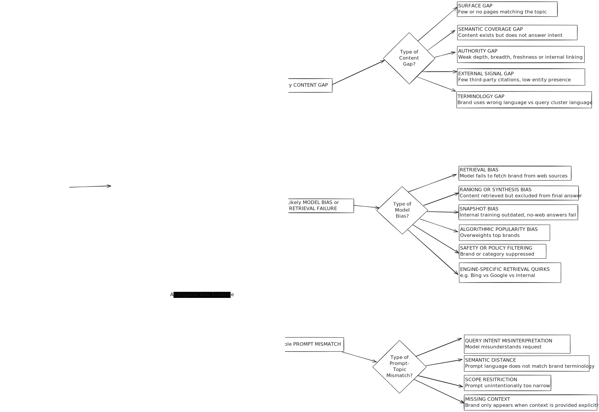

# AI Visibility & Content Gap Playbook

Concise framework to diagnose why a brand is (or is not) surfaced by AI answer engines (Google AI Overview / AI Mode, ChatGPT, Perplexity, etc.) and how to remediate. The system auto‑generates large prompt & keyword clusters enriched with: semantic topic tags, funnel stage, intent probability, entities & aspect sentiment, cited source taxonomy (news / blogs / proprietary / forums), and brand/domain presence signals.

Goal: Separate lack of content (true gap) from model retrieval / synthesis failure (model gap) and prescribe targeted fixes.



Figure: Content Gap visualization illustrating CIPS, SCS, TAS, EPW and their relation to CG and AIV.
## Core Scores
We compute two headline metrics per topic cluster:

1. AI Visibility (AIV): proportion of engines + prompts where brand (name OR domain OR canonical entity) appears in answer text OR cited sources.
2. Content Gap (CG): composite inverse availability / quality index of usable evidence for those prompts.

Decision quadrants:
- Low CG, Low AIV → Model Gap (improve discoverability / structure / external corroboration)
- High CG, Low AIV → True Content Gap (create / expand authoritative clusters)
- Low CG, High AIV → Overperformance (monitor; possible algorithmic favoritism)
- High CG, High AIV → Underoptimized Presence (refine quality / alignment / freshness)

## Formulas (normalized 0–1)
Let each sub-score be already scaled 0–1.

**Content Gap** (lower is better content availability):
```
CG = 1 - (w_cips*CIPS + w_scs*SCS + w_tas*TAS + w_epw*EPW)
```
Default: all weights = 0.25 (tune via regression vs historical visibility). Keep sum(weights)=1.

**AI Visibility**:
```
AIV = (brandAnswerHits + brandSourceHitsWeighted) / (totalPromptEngineEvaluations)
```
Where `brandSourceHitsWeighted = Σ sourceTypeWeight * hits(sourceType)` (e.g. owned=0.6, independent=1.0, gov/edu=1.1).

**Model Reliability** (MR) per engine:
```
MR = 1 - (omitRate*α + retrievalMissRate*β + synthesisDropRate*γ)
```
Used to flag systematic model bias when MR < threshold despite good CG.

# Content Gap Dimensions

We compute a combined Content Gap Score (CG) to quantify missing or weak content.

### 1. Surface Gap → Crawl / Index Presence (CIPS)
Measures whether the brand’s pages appear in search results for relevant queries. For each prompt cluster, run web searches (Google, Bing or SerpAPI) using representative queries. Count how many of the top 50 results belong to the brand’s domain.

Definition: Are there enough brand‐owned pages ranking / indexable for the cluster queries?

Data:
- Top 50 (or 20 if constrained) SERP results per generated query (Google, Bing, optional vertical engines via API)
- Canonical brand domains list

Calculation:
```
CIPS = (# distinct brand URLs appearing in top K across all queries) / (K * #queries)
```

Alternative: use visibility share (sum(positionWeight) / maxPossibleWeight).

Thresholds (heuristic): <0.10 severe, 0.10–0.30 moderate, >0.30 healthy.

Remediation:
- Create dedicated landing pages per high‑intent subtopic.
- Ensure indexability: sitemap inclusion, no accidental noindex, fast LCP.
- Add internal links from high authority pages to new cluster pages.

### 2. Semantic Coverage Score (SCS)
Evaluates whether existing brand content semantically matches the topic intent. Retrieve the top N brand pages for the topic (via site search or SEO tools). Use an embedding model or LLM to compute vector embeddings for each page and for a canonical query or prompt describing the topic. Compute cosine similarity between each page’s embedding and the query embedding, then take the mean (or max) as SCS

Definition: Do existing pages actually answer the user intent?

Data:
- Top N (5–15) candidate pages from site search / existing SEO data / embeddings ANN
- Topic canonical prompt text + variant intents

Calculation:
```
SCS = mean( cosine(embedding(page_i), embedding(topicCanonical)) )
```

Option: use max for “at least one strong” vs mean for “overall cluster coverage”.

Thresholds: <0.55 poor, 0.55–0.70 partial, >0.70 strong.

Remediation:
- Expand sections answering comparative / transactional / FAQ intents.
- Add structured summaries (bullets, tables) the models can extract.
- Include explicit terminology from top user phrasing (avoid only internal jargon).

### 3. Topical Authority Score (TAS)

Assesses the quality and scope of on-topic content. Factors include:

- Depth: Total amount of content on topic (e.g. number of pages or cumulative word count on subtopics).
- Breadth: Coverage of related subtopics or query variations (number of unique angle, FAQ, or intent types covered).
- Internal Linking: How well pages link to each other (creating a topic cluster). Internal linking helps establish a site’s topical focus
- Freshness: Recency of updates. Fresh content tends to rank better on time-sensitive queries
- E-E-A-T Signals: Experience/Expertise/Authority/Trust signals such as author bylines, references, citations, or user reviews. Clear author info and credible citations boost authority.

Definition: Depth, breadth, freshness, and internal linking strength around the topic.

Data:
- Count of pages tagged to topic + subtopics
- Age / last update timestamps
- Internal link graph (edges referencing topic pages)
- EEAT markers extracted (author schema, citations count)

Calculation:
```
TAS = w1*depthNorm + w2*breadthNorm + w3*linkDensityNorm + w4*freshnessNorm + w5*eeatNorm
```
Normalize each metric 0–1 (e.g. depthNorm = min(pageCount / targetDepth, 1)). Weights tune by industry (e.g. medical increases w5).

Thresholds: <0.40 weak, 0.40–0.65 building, >0.65 authoritative.

Remediation:
- Add missing subtopic pages (map via competitor & FAQ extraction).
- Refresh stale high‑traffic pages (update date, add new data points).
- Consolidate thin pages (merge & 301) to concentrate authority.
- Strengthen hub page with contextual internal links and summary blocks.

### 4. External Presence & Witness (EPW)

Measures third-party mentions of the brand in the topic context. LLMs often rely on external signals (e.g. Wikipedia, forums, news) to validate information. Search for the brand name together with topic keywords across: Wikipedia/Wikidata, industry blogs, news media, directories, review sites, and forums. Count the number of independent sources that mention the brand in a relevant way. Normalize by a hypothetical maximum (e.g. count of sources found or a fixed ceiling).

Definition: Independent corroboration of brand relevance in third‑party sources.

Data:
- Mentions in news, reviews, comparison lists, forums, Wikipedia/Wikidata, directories
- Entity extraction from scraped snippets (NER model)

Calculation:
```
EPW = (# unique independent sources with brand+topic co‑mention) / (maxExpectedSources)
```
Adjust maxExpectedSources by vertical maturity (e.g. enterprise SaaS may have higher).

Thresholds: <0.15 critical, 0.15–0.40 limited, >0.40 strong.

Remediation:
- Secure inclusion in comparison guides & category lists.
- Pitch authoritative publications with data‑rich thought leadership.
- Encourage review generation (verified testimonials, third‑party platforms).
- Contribute to open standards / community docs (increases durable citations).

### 5. Terminology Alignment Gap (TAG)  (Optional augment)

Even with content present, if the brand uses different terminology than the query, LLMs may not link them. For example, if users ask “eco-friendly CRM” but your site always says “sustainable business software”, the semantic distance can be high. Measure this by computing embeddings for query keywords and comparing to page text embeddings: large distance signals a terminology gap. Alternatively, use keyword analysis to spot synonyms used in top AI answers vs. your pages.

Definition: Divergence between user cluster phrasing and onsite lexicon.

Data:
- Keyword cluster top phrases
- Onsite corpus extracted n‑grams

Calculation:
```
TAG = 1 - Jaccard( normalizedTopTerms_cluster , normalizedTopTerms_site )
```

Or embedding distance. Use TAG to adjust SCS (penalize high distance).

Remediation:
- Incorporate dominant user terms in headings, intro paragraphs, structured lists.
- Maintain synonym map; avoid keyword stuffing—prioritize clarity.

## Data Collection Summary (Minimal Viable Inputs)
- SERP Results: API (SerpAPI/Bing) daily or weekly.
- Site Pages: sitemap + crawl + embeddings index refresh weekly.
- Internal Links: crawl graph snapshot monthly.
- External Mentions: news/blog/forum aggregators + periodic scrape (weekly / monthly).
- Embeddings: OpenAI / local model; recompute for changed pages only.
- EEAT markers: parse schema, author blocks, citation counts per refresh.

## Scoring Pseudocode (Illustrative)
```pseudo
for topicCluster in clusters:
  queries = generateQueries(topicCluster)
  serpData = fetchSerpTopK(queries, K=50)
  CIPS = countBrandUrls(serpData)/ (K * len(queries))

  pages = selectCandidatePages(topicCluster, N=10)
  SCS = mean( cosine(embed(page.text), embed(topicCluster.canonical)) )

  TAS = combine(
    depthNorm(pages), breadthNorm(subtopicsCovered(pages)),
    linkDensityNorm(internalLinks(pages)), freshnessNorm(pages), eeatNorm(pages)
  )

  externalMentions = collectExternalSources(topicCluster)
  EPW = uniqueCoMentions(externalMentions)/maxExpected(topicCluster.vertical)

  CG = 1 - (0.25*CIPS + 0.25*SCS + 0.25*TAS + 0.25*EPW)

  aivHits = countBrandPresenceInModelAnswers(topicCluster)
  sourceHitsWeighted = weightedSourceMentions(topicCluster)
  AIV = (aivHits + sourceHitsWeighted)/(totalEvaluations(topicCluster))

  quadrant = classify(CG, AIV)
  recommendations = buildRemediation(quadrant, CIPS,SCS,TAS,EPW)
```

# Model Bias Analysis

When content exists but AI visibility is low, the problem is often model bias or technical retrieval issues.

Focus: When CG is moderate/low yet AIV is low.

### Retrieval Bias

The LLM’s retrieval component fails to fetch the brand’s relevant pages. (The content is on the web, but not surfaced by the model.) This can happen if the search index is outdated or if the query formulation misses the brand.

Definition: Brand evidence exists but model fails to surface it during web / tool retrieval.

Detection:
- Compare brand presence in raw scraped sources vs final answer mentions.
    - High `retrievalMissRate = (expectedSourcesWithBrand - retrievedSourcesWithBrand)/expectedSourcesWithBrand`.
- Other models or search results mention the brand for the same query, but the target LLM does not
    - Compare outputs across engines (Google AI, Bing Copilot, ChatGPT with browsing, Perplexity, etc.). If a competitor’s LLM finds the brand but your LLM does not, there’s likely a retrieval gap.
- try forcing the model: ask a question listing “all brands including [Brand]” to see if it’s in its knowledge

Remediation:
- Strengthen structured data (schema.org, JSON-LD) and canonical clarity.
- Ensure consistent naming (avoid fragmented brand variants).
- Improve page load performance (slower pages less likely to be crawled in limited retrieval windows).

### Ranking / Synthesis Bias
The model retrieves relevant content that includes your brand, but downranks or omits it in the answer synthesis.

Definition: Retrieved but filtered out in final answer.

Detection: Brand appears in retrieval trace / citation list but absent in narrative text.

Metric: `synthesisDropRate = brandRetrievedNotUsed / brandRetrievedTotal`.

Remediation:
- Add concise, high‑salience summaries (list benefits, comparison tables) to increase selection probability.
- Provide authoritative external corroboration (reduces model confidence penalty): **backlinks**
- Reduce ambiguity: unify overlapping pages (canonicalization) so relevance score concentrates.

### Snapshot Bias
The LLM’s training data or cached knowledge is outdated. A chat model without web access may simply not “know” about new content or brands.

Definition: Model internal knowledge outdated; fails when forced no‑web mode.

Remediation:
- Supply contextual packets via RAG / embedding context injection.
- Create evergreen, high‑authority reference pages (more likely in pretraining snapshots for future updates).

### Popularity / Safety / Engine Quirks

Models (and their search indices) may overweight big brands. Stan found that “AI Mode runs two systems: the sidebar explores diverse sources, but below the answer it heavily mirrors traditional rankings" (stanventures.com). Smaller brands often lose out. Likewise, user-generated content platforms (Reddit, YouTube) now heavily influence AI answers.

Monitoring only; remediation limited if category suppressed. Escalate to alternative channels (own RAG, paid surfacing, partner content) when systemic.

### Model Reliability Score (MR)
```
MR = 1 - (0.4*omitRate + 0.3*retrievalMissRate + 0.3*synthesisDropRate)
```
Flag potential bias if MR < 0.5 while CG < 0.5.

We mark **algorithmic suppression** if the brand has solid content and web presence (high CG components) but is systematically absent in answers. In that case, check if:
- The brand appears in search but not in citations (ranking bias).
- Alternative engines do include the brand (engine bias).
- The brand was only recently updated (snapshot bias).
- Stan emphasizes: “Ranking #1 on Google does not guarantee a spot in AI answers”
stanventures.com, and “citations beat rankings” – if your brand isn’t cited in multiple contexts (news, forums, etc.), it may as well be invisible to LLMs.

# Prompt Mismatch & Query Framing

Sometimes the issue isn’t the content but the prompts used to test visibility. Key mismatches are:
- **Query Intent Misinterpretation**: The LLM misunderstands what the user wants. E.g. a brand’s page might answer “how to use product X”, but the prompt was phrased in a way that the model sought general information. Fix: Adjust prompts to be more specific or include intent cues. If testing a product brand, explicitly state the category (“…including lesser-known brands in fintech”).
- **Semantic Distance**: The wording of the prompt doesn’t match the brand’s terminology. We saw this in the Terminology Gap above. Fix: Try prompts with synonyms or related phrases; or update content wording (as above) so the model sees less distance between prompt and page language.
- **Scope Restriction**: If a prompt is very narrow, the model may not realize the brand is relevant. For example, asking “What are the features of X?” might lead to product docs, whereas “Which brands offer [feature]?” invites brand names. Fix: Broaden or reframe prompts. Include the brand in the question to test explicitly, e.g. “Does [Brand] have [feature]?”
- **Missing Context**: The LLM only mentions the brand when given context. If you find the brand appears only in prompt-based tasks (“Does Brand X do Y?”) but not in open queries, ensure your prompts include enough category or context information. Fix: Include necessary context (industry, location, use-case) in prompts.

| Type | Symptom | Fix |
|------|---------|-----|
| Intent Misinterpretation | Answer addresses wrong funnel stage | Add explicit intent qualifier ("transactional", "compare") |
| Semantic Distance | Uses jargon not aligned with cluster | Insert user synonyms / rephrase with dominant term |
| Scope Restriction | Prompt too narrow excludes brand category | Broaden with category range / add context sentence |
| Missing Context | Brand only appears when explicitly named | Add descriptor hints (category, region, key differentiator) |

Remediation Hierarchy: 1) Adjust prompt template → 2) Align terminology onsite → 3) Expand evidence pages.


# Remediation Playbook (Condensed)
| Gap | Quick Win | Strategic Build |
|-----|-----------|-----------------|
| Surface (CIPS) | Create targeted landing & indexable FAQ | Cluster hub + systematic internal linking |
| Semantic (SCS) | Add explicit intent sections & glossary terms | Rewrite / expand with structured comparative analysis |
| Authority (TAS) | Refresh stale top pages | Full topic hub + breadth of subtopics + citation program |
| External (EPW) | Secure inclusion in 1–2 comparison lists | Ongoing PR + community / standards participation |
| Terminology (TAG) | Map & inject top missing phrases | Maintain dynamic synonym & user phrasing model |
| Retrieval Bias | Add schema + unify naming | Performance, consolidation, structured data coverage |
| Synthesis Bias | Add high‑salience structured summaries | Strengthen external corroboration & unique data assets |
| Snapshot Bias | Provide RAG context | Evergreen reference & data publications |

Prioritization: Address EPW & CIPS first (foundational evidence), then SCS/TAS for qualitative uplift, finally model biases if visibility still lags.


# Reporting Output (Per Topic Cluster)
```
Cluster: "Eco-friendly CRM"
CIPS: 0.08  (Severe)  | SCS: 0.62 (Partial) | TAS: 0.41 (Building) | EPW: 0.12 (Critical)
CG: 0.69  | AIV: 0.15  | Quadrant: True Content Gap
Primary Bottleneck: External corroboration & surface presence
Top 3 Actions: (1) Publish comparison guide; (2) Secure review listings; (3) Build hub + subtopic pages.
MR (average): 0.78 (No model bias flag)
TAG: 0.35 (Moderate misalignment – missing "eco-friendly" term)
```


# Implementation Workflow (Lean)
1. Generate clusters & collect baseline data.
2. Compute scores & classify quadrants.
3. Auto‑compose remediation recommendations.
4. Human review + priority weighting (impact vs effort).
5. Execute quick wins (<2 weeks) then strategic builds (>2 weeks).
6. Re‑measure monthly (content) / weekly (visibility deltas).

# Summary
This playbook provides measurable levers (CIPS, SCS, TAS, EPW, TAG, AIV, MR) to distinguish *content deficits* from *model bias* and *prompt framing issues*, enabling precise, staged remediation instead of generic SEO advice.

# Appendix

## EEAT markers

EEAT is an acronym for Experience, Expertise, Authoritativeness, and Trustworthiness—a framework Google uses to evaluate the quality and credibility of online content. These are qualities that Google rewards in its search rankings, even though EEAT isn't a direct ranking factor itself. Websites can demonstrate EEAT through factors like author bios, citations, and accurate information to build a good online reputation and satisfy user search intent.

### Experience
- What it is: First-hand, practical knowledge of a topic.
- How to show it: A travel writer who has personally hiked the trails they recommend demonstrates experience. Including case studies or first-person accounts can also show experience.

### Expertise
- What it is: Deep knowledge or skill in a subject, often shown through formal education, certifications, or years of practice.
- How to show it: A doctor writing about diabetes showcases expertise through their medical training. Including credentials and author bios helps demonstrate expertise.

### Authoritativeness
- What it is: The reputation of the creator or website as a go-to source in their field.
- How to show it: Building authoritative backlinks from reputable sources, being cited by others, and having a strong reputation within your niche can demonstrate authority.

### Trustworthiness
- What it is: The accuracy, safety, and reliability of both the content and the website it's published on.
- How to show it: Ensuring content is accurate, providing clear contact information, citing reputable sources, and maintaining a secure website (https) build trust. For "Your Money or Your Life" (YMYL) topics like health and finance, trustworthiness is especially critical.